# SOFTWARE SPECIFICATION
## Restaurant CRM Platform — Admin System
## Module: License & Subscription Management

| | |
|---|---|
| **Document Type** | Technical Specification (Backend Implementation) |
| **Domain** | Admin System |
| **Module** | License Plan Management & License Subscription Management |
| **Version** | 1.0 |
| **Author** | Senior Solution Architect / Business Analyst / Technical Lead |
| **Target Audience** | Backend Development Team |
| **Tech Stack** | Spring Boot 3, Java 21, Spring Security, PostgreSQL, JPA/Hibernate, Flyway, Lombok, MapStruct, RESTful API |

---

## MỤC LỤC

1. [Tổng quan hệ thống](#1-tổng-quan-hệ-thống)
2. [Mô hình nghiệp vụ (Business Model)](#2-mô-hình-nghiệp-vụ-business-model)
3. [Thiết kế Database](#3-thiết-kế-database)
4. [Quy ước chung áp dụng cho toàn bộ Use Case](#4-quy-ước-chung-áp-dụng-cho-toàn-bộ-use-case)
5. [UC-LIC-01: Create License](#uc-lic-01-create-license)
6. [UC-LIC-02: Update License](#uc-lic-02-update-license)
7. [UC-LIC-03: Delete License (Soft Delete)](#uc-lic-03-delete-license-soft-delete)
8. [UC-LIC-04: Lock License](#uc-lic-04-lock-license)
9. [UC-LIC-05: Reactivate License](#uc-lic-05-reactivate-license)
10. [UC-SUB-00: Grant Subscription (Cấp License thủ công)](#uc-sub-00-grant-subscription-cấp-license-thủ-công)
11. [UC-SUB-01: Renew Subscription](#uc-sub-01-renew-subscription)
12. [UC-SUB-02: Revoke Subscription](#uc-sub-02-revoke-subscription)
13. [UC-SUB-03: View License Detail](#uc-sub-03-view-license-detail)
14. [Phụ lục: Định hướng mở rộng cho Payment (Future Design)](#13-phụ-lục-định-hướng-mở-rộng-cho-payment-future-design)

---

## 1. Tổng quan hệ thống

### 1.1. Bối cảnh

Restaurant CRM Platform là một nền tảng SaaS quản lý nhà hàng đa chi nhánh (Multi-tenant Restaurant Management Platform), được thiết kế theo kiến trúc gồm 3 domain lớn:

- **Admin System**: Hệ thống quản trị nội bộ, do System Admin của Platform vận hành. Đây là domain mà tài liệu này tập trung thiết kế.
- **Restaurant Management System**: Hệ thống dành cho Restaurant Owner / Restaurant Staff quản lý vận hành nhà hàng (chi nhánh, nhân viên, thực đơn, đơn hàng...).
- **Customer System**: Hệ thống dành cho khách hàng cuối đặt món, đặt bàn...

Tài liệu này chỉ thiết kế chi tiết cho các Use Case thuộc **Admin System**, cụ thể là nhóm chức năng **License Plan Management** và **License Subscription Management**.

### 1.2. Phạm vi tài liệu

Tài liệu bao gồm:

- Thiết kế Database (Entity, Field, Relationship, Constraint).
- Business Rule đầy đủ cho từng nghiệp vụ.
- Đặc tả chi tiết 8 Use Case, mỗi Use Case gồm 17 mục theo chuẩn: Overview, Business Rules, Preconditions, Postconditions, Main Flow, Alternative Flow, Exception Flow, Validation Rules, Database Changes, API Design, DTO Design, Sequence Diagram, Activity Diagram, Business Logic (pseudo code), Edge Cases, Acceptance Criteria, Test Scenarios.

### 1.3. Ngoài phạm vi (Out of Scope) tại Phase hiện tại

- **Payment Integration**: Chưa tích hợp cổng thanh toán. Việc cấp License cho Restaurant Owner được thực hiện thủ công bởi System Admin.
- **Permission / Authorization chi tiết**: Chưa mô tả chi tiết permission matrix. Tài liệu chỉ đánh dấu vị trí (`// TODO: PERMISSION CHECK`) trong pseudo code để đội Backend biết vị trí sẽ bổ sung kiểm tra quyền ở giai đoạn sau.
- **Restaurant Owner tự Renew Subscription**: Chưa cho phép, chỉ System Admin được Renew.

---

## 2. Mô hình nghiệp vụ (Business Model)

### 2.1. Nguyên tắc cốt lõi

1. Platform cung cấp nhiều **License Plan** (gọi tắt là **License**). License là một **gói dịch vụ mẫu** (template/plan), KHÔNG đại diện cho license cụ thể của một khách hàng.
2. Restaurant Owner đăng ký sử dụng một License Plan. Vì chưa có Payment, **System Admin cấp License thủ công** cho Restaurant Owner (bằng cách tạo một **License Subscription** gắn với Organization của Owner đó).
3. Mỗi Restaurant tương ứng với một **Organization**.
4. Một **Organization chỉ có đúng một Subscription đang ACTIVE tại một thời điểm** — đây là ràng buộc nghiệp vụ bắt buộc (business invariant), phải được đảm bảo ở tầng Service/Database.
5. Một Restaurant Owner có thể sở hữu **nhiều Organization**.

```text
Owner A
├── Organization A ── (1 Active Subscription)
├── Organization B ── (1 Active Subscription)
└── Organization C ── (1 Active Subscription)
```

6. **License_Subscription lưu snapshot của License tại thời điểm cấp.** Sau này nếu License gốc bị thay đổi (sửa giá, sửa max_branch...) thì các Subscription đã cấp trước đó **không bị ảnh hưởng**. Đây là business rule bắt buộc, không được vi phạm dưới bất kỳ hình thức nào trong toàn bộ các Use Case.

### 2.2. Sơ đồ quan hệ tổng quát

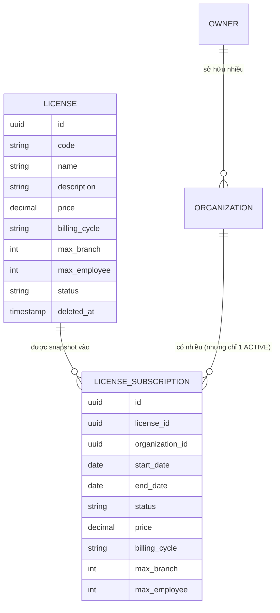
```mermaid
erDiagram
    LICENSE ||--o{ LICENSE_SUBSCRIPTION : "được snapshot vào"
    ORGANIZATION ||--o{ LICENSE_SUBSCRIPTION : "có nhiều (nhưng chỉ 1 ACTIVE)"
    OWNER ||--o{ ORGANIZATION : "sở hữu nhiều"

    LICENSE {
        uuid id
        string code
        string name
        string description
        decimal price
        string billing_cycle
        int max_branch
        int max_employee
        string status
        timestamp deleted_at
    }

    LICENSE_SUBSCRIPTION {
        uuid id
        uuid license_id
        uuid organization_id
        date start_date
        date end_date
        string status
        decimal price
        string billing_cycle
        int max_branch
        int max_employee
    }
```

### 2.3. State Machine — License.status

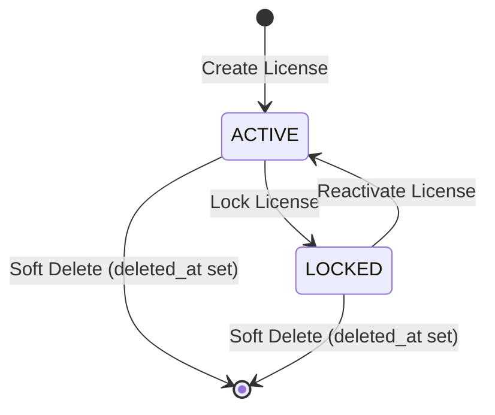
```mermaid
stateDiagram-v2
    [*] --> ACTIVE : Create License
    ACTIVE --> LOCKED : Lock License
    LOCKED --> ACTIVE : Reactivate License
    ACTIVE --> [*] : Soft Delete (deleted_at set)
    LOCKED --> [*] : Soft Delete (deleted_at set)
```

Lưu ý: Soft Delete không thực sự chuyển state, chỉ đánh dấu `deleted_at`. License đã xoá vẫn giữ nguyên `status` cuối cùng của nó trong DB (chỉ để tham chiếu lịch sử), nhưng bị loại khỏi mọi truy vấn nghiệp vụ đang hoạt động (xem mục 4.4).

### 2.4. State Machine — License_Subscription.status

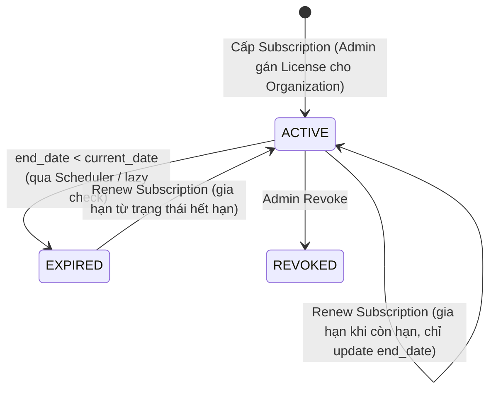
```mermaid
stateDiagram-v2
    [*] --> ACTIVE : Cấp Subscription (Admin gán License cho Organization)
    ACTIVE --> EXPIRED : end_date < current_date (qua Scheduler / lazy check)
    ACTIVE --> REVOKED : Admin Revoke
    EXPIRED --> ACTIVE : Renew Subscription (gia hạn từ trạng thái hết hạn)
    ACTIVE --> ACTIVE : Renew Subscription (gia hạn khi còn hạn, chỉ update end_date)
```

Ghi chú: `REVOKED` là trạng thái **cuối** (terminal state) trong phạm vi Phase hiện tại — không có Use Case nào phục hồi Subscription REVOKED. Nếu Organization cần dùng lại License, System Admin sẽ tạo Subscription mới (ngoài phạm vi tài liệu này, xem mục 13).

---

## 3. Thiết kế Database

### 3.1. Bảng `license`

| Field | Type | Nullable | Default | Ghi chú |
|---|---|---|---|---|
| `id` | UUID (PK) | NOT NULL | `gen_random_uuid()` | Primary key |
| `code` | VARCHAR(50) | NOT NULL | — | **Unique**, **Immutable** — không được sửa sau khi tạo |
| `name` | VARCHAR(255) | NOT NULL | — | Tên hiển thị của License Plan |
| `description` | TEXT | NULL | — | Mô tả chi tiết |
| `price` | NUMERIC(15,2) | NOT NULL | — | Giá niêm yết, `>= 0` |
| `billing_cycle` | VARCHAR(20) | NOT NULL | — | Enum: `MONTHLY`, `YEARLY` |
| `max_branch` | INTEGER | NOT NULL | — | `>= -1`; `-1` = Unlimited |
| `max_employee` | INTEGER | NOT NULL | — | `>= -1`; `-1` = Unlimited |
| `status` | VARCHAR(20) | NOT NULL | `ACTIVE` | Enum: `ACTIVE`, `LOCKED` |
| `deleted_at` | TIMESTAMP | NULL | `NULL` | Soft delete marker |
| `created_at` | TIMESTAMP | NOT NULL | `now()` | |
| `updated_at` | TIMESTAMP | NOT NULL | `now()` | Auto-update on change |

**Index / Constraint đề xuất:**

```sql
CREATE UNIQUE INDEX uq_license_code ON license (code);
CREATE INDEX idx_license_status ON license (status) WHERE deleted_at IS NULL;
CREATE INDEX idx_license_deleted_at ON license (deleted_at);
```

> Lưu ý: `code` là unique **toàn cục**, kể cả với các record đã bị soft-delete (vì business rule không yêu cầu tái sử dụng code sau khi xoá — xem mục Edge Case của UC-LIC-01/UC-LIC-03 để BA/Backend thống nhất thêm nếu phát sinh yêu cầu tái sử dụng code).

### 3.2. Bảng `license_subscription`

| Field | Type | Nullable | Default | Ghi chú |
|---|---|---|---|---|
| `id` | UUID (PK) | NOT NULL | `gen_random_uuid()` | Primary key |
| `license_id` | UUID (FK → license.id) | NOT NULL | — | License gốc được snapshot (chỉ để tham chiếu/audit, KHÔNG dùng để đọc giá trị hiện hành) |
| `organization_id` | UUID (FK → organization.id) | NOT NULL | — | Organization được cấp Subscription |
| `start_date` | DATE | NOT NULL | — | Ngày bắt đầu hiệu lực |
| `end_date` | DATE | NOT NULL | — | Ngày hết hạn |
| `status` | VARCHAR(20) | NOT NULL | `ACTIVE` | Enum: `ACTIVE`, `EXPIRED`, `REVOKED` |
| `price` | NUMERIC(15,2) | NOT NULL | — | **Snapshot** giá tại thời điểm cấp |
| `billing_cycle` | VARCHAR(20) | NOT NULL | — | **Snapshot** billing cycle tại thời điểm cấp |
| `max_branch` | INTEGER | NOT NULL | — | **Snapshot** max_branch tại thời điểm cấp |
| `max_employee` | INTEGER | NOT NULL | — | **Snapshot** max_employee tại thời điểm cấp |
| `created_at` | TIMESTAMP | NOT NULL | `now()` | |
| `updated_at` | TIMESTAMP | NOT NULL | `now()` | |

**Index / Constraint đề xuất:**

```sql
CREATE INDEX idx_sub_organization ON license_subscription (organization_id);
CREATE INDEX idx_sub_license ON license_subscription (license_id);

-- Ràng buộc nghiệp vụ bắt buộc: 1 Organization chỉ có 1 Subscription ACTIVE tại 1 thời điểm.
-- PostgreSQL không hỗ trợ UNIQUE WHERE trực tiếp trên nhiều dòng khác NULL theo enum,
-- do đó dùng Partial Unique Index:
CREATE UNIQUE INDEX uq_one_active_subscription_per_org
    ON license_subscription (organization_id)
    WHERE status = 'ACTIVE';
```

> **Business Invariant quan trọng nhất của toàn bộ module**: Partial Unique Index `uq_one_active_subscription_per_org` là **tuyến phòng thủ cuối cùng** ở tầng Database, đảm bảo dù có race-condition ở tầng ứng dụng thì DB vẫn từ chối insert/update tạo ra 2 Subscription ACTIVE cho cùng 1 Organization. Tầng Service PHẢI kiểm tra trước (business validation) để trả lỗi thân thiện, nhưng KHÔNG được bỏ qua constraint này ở tầng DB.

### 3.3. Entity Relationship Diagram chi tiết

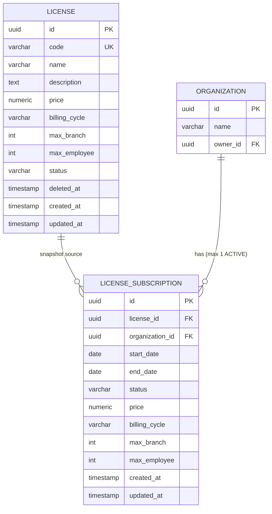
```mermaid
erDiagram
    LICENSE {
        uuid id PK
        varchar code UK
        varchar name
        text description
        numeric price
        varchar billing_cycle
        int max_branch
        int max_employee
        varchar status
        timestamp deleted_at
        timestamp created_at
        timestamp updated_at
    }
    LICENSE_SUBSCRIPTION {
        uuid id PK
        uuid license_id FK
        uuid organization_id FK
        date start_date
        date end_date
        varchar status
        numeric price
        varchar billing_cycle
        int max_branch
        int max_employee
        timestamp created_at
        timestamp updated_at
    }
    ORGANIZATION {
        uuid id PK
        varchar name
        uuid owner_id FK
    }
    LICENSE ||--o{ LICENSE_SUBSCRIPTION : "snapshot source"
    ORGANIZATION ||--o{ LICENSE_SUBSCRIPTION : "has (max 1 ACTIVE)"
```

### 3.4. Flyway Migration đề xuất

```sql
-- V1__create_license_table.sql
CREATE TABLE license (
    id UUID PRIMARY KEY DEFAULT gen_random_uuid(),
    code VARCHAR(50) NOT NULL,
    name VARCHAR(255) NOT NULL,
    description TEXT,
    price NUMERIC(15,2) NOT NULL CHECK (price >= 0),
    billing_cycle VARCHAR(20) NOT NULL CHECK (billing_cycle IN ('MONTHLY','YEARLY')),
    max_branch INTEGER NOT NULL CHECK (max_branch >= -1),
    max_employee INTEGER NOT NULL CHECK (max_employee >= -1),
    status VARCHAR(20) NOT NULL DEFAULT 'ACTIVE' CHECK (status IN ('ACTIVE','LOCKED')),
    deleted_at TIMESTAMP NULL,
    created_at TIMESTAMP NOT NULL DEFAULT now(),
    updated_at TIMESTAMP NOT NULL DEFAULT now()
);
CREATE UNIQUE INDEX uq_license_code ON license (code);

-- V2__create_license_subscription_table.sql
CREATE TABLE license_subscription (
    id UUID PRIMARY KEY DEFAULT gen_random_uuid(),
    license_id UUID NOT NULL REFERENCES license(id),
    organization_id UUID NOT NULL REFERENCES organization(id),
    start_date DATE NOT NULL,
    end_date DATE NOT NULL,
    status VARCHAR(20) NOT NULL DEFAULT 'ACTIVE' CHECK (status IN ('ACTIVE','EXPIRED','REVOKED')),
    price NUMERIC(15,2) NOT NULL,
    billing_cycle VARCHAR(20) NOT NULL CHECK (billing_cycle IN ('MONTHLY','YEARLY')),
    max_branch INTEGER NOT NULL,
    max_employee INTEGER NOT NULL,
    created_at TIMESTAMP NOT NULL DEFAULT now(),
    updated_at TIMESTAMP NOT NULL DEFAULT now()
);
CREATE INDEX idx_sub_organization ON license_subscription (organization_id);
CREATE INDEX idx_sub_license ON license_subscription (license_id);
CREATE UNIQUE INDEX uq_one_active_subscription_per_org
    ON license_subscription (organization_id) WHERE status = 'ACTIVE';
```

---

## 4. Quy ước chung áp dụng cho toàn bộ Use Case

### 4.1. Actor

| Actor | Mô tả |
|---|---|
| **System Admin** | Nhân sự vận hành Platform, có toàn quyền quản lý License và Subscription. Là actor duy nhất cho tất cả Use Case trong tài liệu này ở Phase hiện tại. |
| **Restaurant Owner** | Chủ nhà hàng. Ở Phase hiện tại **KHÔNG** có quyền thao tác trực tiếp lên License/Subscription (chỉ xem, xem tại module khác ngoài phạm vi). |

### 4.2. Quy ước Response Envelope chung

Tất cả API trong tài liệu đều tuân theo envelope chuẩn sau (giả định đã có ở tầng framework chung của platform):

```json
{
  "success": true,
  "data": { },
  "error": null,
  "timestamp": "2026-07-23T10:00:00Z"
}
```

Khi lỗi:

```json
{
  "success": false,
  "data": null,
  "error": {
    "code": "LICENSE_CODE_DUPLICATED",
    "message": "License code already exists"
  },
  "timestamp": "2026-07-23T10:00:00Z"
}
```

### 4.3. Quy ước Header chung

```
Authorization: Bearer {jwt_token}
Content-Type: application/json
X-Tenant-Context: ADMIN
```

> `// TODO: PERMISSION CHECK` — Vị trí kiểm tra quyền `ADMIN_LICENSE_MANAGE` sẽ được bổ sung tại Spring Security `@PreAuthorize` hoặc Method Security Interceptor. Hiện tại chưa mô tả chi tiết permission matrix theo yêu cầu của Phase này.

### 4.4. Quy ước truy vấn (Query Convention)

- Mọi query nghiệp vụ (list, search, detail) đối với `license` **mặc định phải loại trừ** các record có `deleted_at IS NOT NULL`, trừ khi API có tham số tường minh `includeDeleted=true` (dành cho màn hình audit/lịch sử — ngoài phạm vi 8 Use Case chính, chỉ nêu quy ước).
- Repository nên cung cấp 2 method rõ ràng: `findActiveById` (loại trừ deleted) và `findByIdIncludeDeleted` (dùng cho Renew/View Detail khi Subscription cũ tham chiếu tới License đã xoá).

### 4.5. Naming convention Package (đề xuất)

```
com.restaurantcrm.admin.license
 ├── controller
 │    ├── LicenseController.java
 │    └── LicenseSubscriptionController.java
 ├── service
 │    ├── LicenseService.java
 │    ├── LicenseSubscriptionService.java
 │    └── impl
 ├── repository
 │    ├── LicenseRepository.java
 │    └── LicenseSubscriptionRepository.java
 ├── entity
 │    ├── License.java
 │    └── LicenseSubscription.java
 ├── enums
 │    ├── LicenseStatus.java
 │    ├── SubscriptionStatus.java
 │    └── BillingCycle.java
 ├── dto
 │    ├── request
 │    └── response
 ├── mapper
 │    └── LicenseMapper.java (MapStruct)
 └── exception
      ├── LicenseNotFoundException.java
      ├── DuplicateLicenseCodeException.java
      ├── InvalidLicenseStatusException.java
      └── ActiveSubscriptionExistsException.java
```

### 4.6. Enum định nghĩa chuẩn

```java
public enum LicenseStatus {
    ACTIVE,
    LOCKED
}

public enum SubscriptionStatus {
    ACTIVE,
    EXPIRED,
    REVOKED
}

public enum BillingCycle {
    MONTHLY(30),
    YEARLY(365);

    private final int days;
    BillingCycle(int days) { this.days = days; }
    public int getDays() { return days; }
}
```

### 4.7. Bảng mã lỗi chung (Error Code Registry)

| Error Code | HTTP Status | Ý nghĩa |
|---|---|---|
| `LICENSE_NOT_FOUND` | 404 | Không tìm thấy License |
| `LICENSE_CODE_DUPLICATED` | 409 | Trùng `code` |
| `LICENSE_CODE_IMMUTABLE` | 400 | Cố gắng sửa `code` |
| `VALIDATION_ERROR` | 400 | Lỗi validate field |
| `LICENSE_ALREADY_LOCKED` | 409 | Lock License đã LOCKED |
| `LICENSE_ALREADY_ACTIVE` | 409 | Reactivate License đã ACTIVE |
| `LICENSE_STATUS_INVALID_FOR_ACTION` | 409 | Trạng thái không hợp lệ cho hành động |
| `SUBSCRIPTION_NOT_FOUND` | 404 | Không tìm thấy Subscription |
| `ACTIVE_SUBSCRIPTION_EXISTS` | 409 | Organization đã có Subscription ACTIVE |
| `SUBSCRIPTION_ALREADY_REVOKED` | 409 | Revoke Subscription đã REVOKED |
| `ORGANIZATION_NOT_FOUND` | 404 | Không tìm thấy Organization |
| `LICENSE_LOCKED_CANNOT_ISSUE` | 409 | License đang LOCKED, không thể cấp Subscription mới |
| `UNAUTHORIZED` | 401 | Chưa xác thực |
| `FORBIDDEN` | 403 | Không đủ quyền |
| `INTERNAL_SERVER_ERROR` | 500 | Lỗi hệ thống |

---

## UC-LIC-01: Create License

### 1. Overview

| | |
|---|---|
| **Use Case ID** | UC-LIC-01 |
| **Use Case Name** | Create License |
| **Description** | System Admin tạo mới một License Plan để làm cơ sở cấp Subscription cho Restaurant Owner sau này. |
| **Actor** | System Admin |
| **Priority** | High |

### 2. Business Rules

- BR-01: `code` phải **unique** trong toàn hệ thống (kể cả với các License đã bị soft-delete).
- BR-02: `code` là **immutable** — không được sửa sau khi tạo (áp dụng kiểm tra ở UC-LIC-02).
- BR-03: `status` mặc định khi tạo luôn là `ACTIVE`. Không cho phép Client truyền `status` khi tạo.
- BR-04: `price >= 0`.
- BR-05: `billing_cycle` chỉ nhận `MONTHLY` hoặc `YEARLY`.
- BR-06: `max_branch >= -1` (trong đó `-1` = Unlimited).
- BR-07: `max_employee >= -1` (trong đó `-1` = Unlimited).
- BR-08: `deleted_at` luôn là `NULL` khi tạo mới.

### 3. Preconditions

- Actor đã đăng nhập với vai trò System Admin.
- `// TODO: PERMISSION CHECK` — Actor có quyền `ADMIN_LICENSE_CREATE`.

### 4. Postconditions

- Một record mới được tạo trong bảng `license` với `status = ACTIVE`, `deleted_at = NULL`.
- License mới có thể được dùng ngay để cấp Subscription (UC-SUB liên quan, ngoài phạm vi tài liệu Renew/Revoke nhưng liên quan tới "Grant License" — xem ghi chú phần Future Design).

### 5. Main Flow

1. System Admin gửi request `POST /api/v1/admin/licenses` với thông tin License.
2. Hệ thống validate toàn bộ field đầu vào (xem mục 8).
3. Hệ thống kiểm tra `code` đã tồn tại trong DB hay chưa (bao gồm cả bản ghi đã soft-delete).
4. Nếu `code` chưa tồn tại, hệ thống tạo bản ghi `License` mới với `status = ACTIVE`.
5. Hệ thống trả về `201 Created` cùng dữ liệu License vừa tạo.

### 6. Alternative Flow

- **AF-01**: Nếu Admin không truyền `description`, hệ thống lưu `description = NULL` và vẫn tạo thành công (field không bắt buộc).

### 7. Exception Flow

- **EF-01**: Nếu `code` đã tồn tại → trả lỗi `409 Conflict`, error code `LICENSE_CODE_DUPLICATED`.
- **EF-02**: Nếu field bắt buộc thiếu hoặc sai định dạng → trả lỗi `400 Bad Request`, error code `VALIDATION_ERROR`, kèm danh sách lỗi theo field.
- **EF-03**: Nếu lỗi hệ thống (DB down...) → trả lỗi `500 Internal Server Error`, error code `INTERNAL_SERVER_ERROR`.

### 8. Validation Rules

| Field | Rule | Error Message |
|---|---|---|
| `code` | required, string, max 50 ký tự, unique (kể cả deleted) | "License code is required" / "License code already exists" |
| `name` | required, string, max 255 ký tự | "License name is required" |
| `description` | optional, string, max 2000 ký tự | "Description exceeds max length" |
| `price` | required, numeric, `>= 0` | "Price must be greater than or equal to 0" |
| `billing_cycle` | required, enum [`MONTHLY`, `YEARLY`] | "Billing cycle must be MONTHLY or YEARLY" |
| `max_branch` | required, integer, `>= -1` | "Max branch must be -1 or greater" |
| `max_employee` | required, integer, `>= -1` | "Max employee must be -1 or greater" |

### 9. Database Changes

| Table | Thao tác | Field bị thay đổi |
|---|---|---|
| `license` | INSERT | `id, code, name, description, price, billing_cycle, max_branch, max_employee, status(=ACTIVE), deleted_at(=NULL), created_at, updated_at` |

### 10. API Design

**Method**: `POST`
**URL**: `/api/v1/admin/licenses`

**Headers**
```
Authorization: Bearer {jwt_token}
Content-Type: application/json
```

**Request**
```json
{
  "code": "PRO_PLAN",
  "name": "Professional Plan",
  "description": "Dành cho nhà hàng vừa và nhỏ",
  "price": 990000,
  "billingCycle": "MONTHLY",
  "maxBranch": 5,
  "maxEmployee": 50
}
```

**Response (201 Created)**
```json
{
  "success": true,
  "data": {
    "id": "b1e2c3d4-0000-0000-0000-000000000001",
    "code": "PRO_PLAN",
    "name": "Professional Plan",
    "description": "Dành cho nhà hàng vừa và nhỏ",
    "price": 990000,
    "billingCycle": "MONTHLY",
    "maxBranch": 5,
    "maxEmployee": 50,
    "status": "ACTIVE",
    "createdAt": "2026-07-23T10:00:00Z",
    "updatedAt": "2026-07-23T10:00:00Z"
  },
  "error": null
}
```

**HTTP Status**
- `201 Created` — thành công
- `400 Bad Request` — validation lỗi
- `409 Conflict` — trùng code
- `401/403` — auth/permission
- `500` — lỗi hệ thống

**Error Codes**: `VALIDATION_ERROR`, `LICENSE_CODE_DUPLICATED`, `UNAUTHORIZED`, `FORBIDDEN`, `INTERNAL_SERVER_ERROR`

### 11. DTO Design

**Request DTO — `CreateLicenseRequest`**
```java
public class CreateLicenseRequest {

    @NotBlank(message = "License code is required")
    @Size(max = 50)
    private String code;

    @NotBlank(message = "License name is required")
    @Size(max = 255)
    private String name;

    @Size(max = 2000)
    private String description;

    @NotNull
    @DecimalMin(value = "0", inclusive = true, message = "Price must be >= 0")
    private BigDecimal price;

    @NotNull(message = "Billing cycle is required")
    private BillingCycle billingCycle;

    @NotNull
    @Min(value = -1, message = "Max branch must be -1 or greater")
    private Integer maxBranch;

    @NotNull
    @Min(value = -1, message = "Max employee must be -1 or greater")
    private Integer maxEmployee;
}
```

**Response DTO — `LicenseResponse`**
```java
public class LicenseResponse {
    private UUID id;
    private String code;
    private String name;
    private String description;
    private BigDecimal price;
    private BillingCycle billingCycle;
    private Integer maxBranch;
    private Integer maxEmployee;
    private LicenseStatus status;
    private Instant createdAt;
    private Instant updatedAt;
}
```

### 12. Sequence Diagram

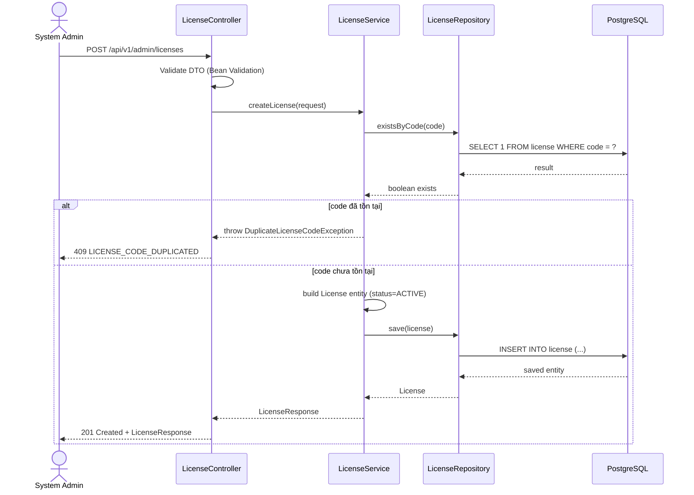
```mermaid
sequenceDiagram
    actor Admin as System Admin
    participant API as LicenseController
    participant SVC as LicenseService
    participant REPO as LicenseRepository
    participant DB as PostgreSQL

    Admin->>API: POST /api/v1/admin/licenses
    API->>API: Validate DTO (Bean Validation)
    API->>SVC: createLicense(request)
    SVC->>REPO: existsByCode(code)
    REPO->>DB: SELECT 1 FROM license WHERE code = ?
    DB-->>REPO: result
    REPO-->>SVC: boolean exists
    alt code đã tồn tại
        SVC-->>API: throw DuplicateLicenseCodeException
        API-->>Admin: 409 LICENSE_CODE_DUPLICATED
    else code chưa tồn tại
        SVC->>SVC: build License entity (status=ACTIVE)
        SVC->>REPO: save(license)
        REPO->>DB: INSERT INTO license (...)
        DB-->>REPO: saved entity
        REPO-->>SVC: License
        SVC-->>API: LicenseResponse
        API-->>Admin: 201 Created + LicenseResponse
    end
```

### 13. Activity Diagram

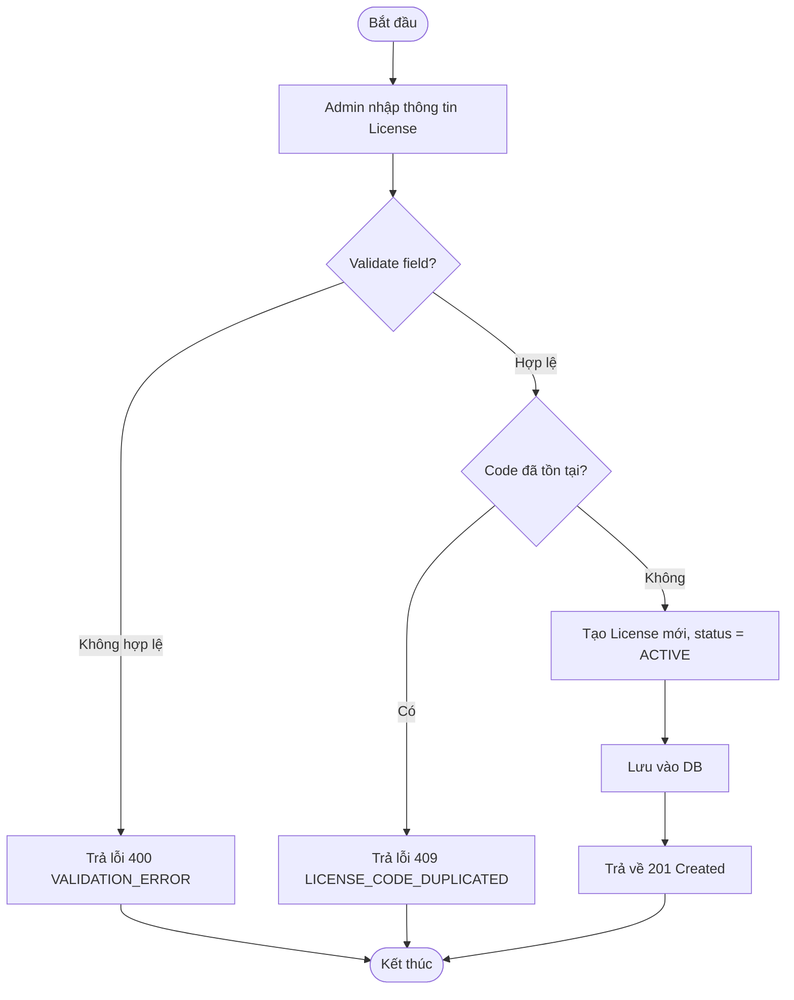
```mermaid
flowchart TD
    A([Bắt đầu]) --> B[Admin nhập thông tin License]
    B --> C{Validate field?}
    C -- Không hợp lệ --> D[Trả lỗi 400 VALIDATION_ERROR]
    D --> Z([Kết thúc])
    C -- Hợp lệ --> E{Code đã tồn tại?}
    E -- Có --> F[Trả lỗi 409 LICENSE_CODE_DUPLICATED]
    F --> Z
    E -- Không --> G[Tạo License mới, status = ACTIVE]
    G --> H[Lưu vào DB]
    H --> I[Trả về 201 Created]
    I --> Z
```

### 14. Business Logic (Pseudo Code)

```text
FUNCTION createLicense(request: CreateLicenseRequest) -> LicenseResponse:
    // TODO: PERMISSION CHECK - ADMIN_LICENSE_CREATE

    VALIDATE request (Bean Validation @Valid tại Controller layer)

    IF licenseRepository.existsByCode(request.code) == true:
        THROW DuplicateLicenseCodeException("License code already exists")

    license = NEW License()
    license.code = request.code
    license.name = request.name
    license.description = request.description
    license.price = request.price
    license.billingCycle = request.billingCycle
    license.maxBranch = request.maxBranch
    license.maxEmployee = request.maxEmployee
    license.status = LicenseStatus.ACTIVE   // luôn ép cứng, KHÔNG nhận từ client
    license.deletedAt = NULL

    savedLicense = licenseRepository.save(license)

    RETURN licenseMapper.toResponse(savedLicense)
END FUNCTION
```

### 15. Edge Cases

| Edge Case | Xử lý |
|---|---|
| Duplicate Code | Trả `409 LICENSE_CODE_DUPLICATED`, không tạo record |
| Code trùng với License đã bị soft-delete | Vẫn coi là duplicate (unique kể cả deleted), trả `409` |
| Truyền `status` trong request | Bị bỏ qua hoàn toàn (DTO không có field `status`), luôn set `ACTIVE` |
| `price = 0` | Hợp lệ (License miễn phí) |
| `maxBranch = -1` và `maxEmployee = -1` | Hợp lệ, thể hiện Unlimited cả hai |
| `code` chứa khoảng trắng / ký tự đặc biệt | Cần chuẩn hoá theo quy tắc riêng của tổ chức (đề xuất: chỉ cho phép `[A-Z0-9_]`, kiểm tra bằng `@Pattern` nếu BA xác nhận thêm) |
| Request thiếu `billingCycle` | Trả `400 VALIDATION_ERROR` |
| Gửi đồng thời 2 request trùng `code` (race condition) | Unique Index DB (`uq_license_code`) sẽ chặn 1 trong 2, Service bắt `DataIntegrityViolationException` và convert thành `LICENSE_CODE_DUPLICATED` |

### 16. Acceptance Criteria

- [ ] Tạo License thành công với đầy đủ field hợp lệ trả về `201` và đúng dữ liệu.
- [ ] `status` luôn là `ACTIVE` sau khi tạo, bất kể client có gửi field này hay không.
- [ ] Tạo License với `code` trùng (kể cả với License đã xoá mềm) trả về `409 LICENSE_CODE_DUPLICATED`.
- [ ] Tạo License thiếu field bắt buộc trả về `400 VALIDATION_ERROR` với danh sách lỗi rõ ràng theo field.
- [ ] Tạo License với `price < 0` bị từ chối.
- [ ] Tạo License với `billingCycle` không thuộc enum bị từ chối.
- [ ] Tạo License với `maxBranch < -1` hoặc `maxEmployee < -1` bị từ chối.
- [ ] `deleted_at` luôn `NULL` sau khi tạo.
- [ ] Race condition tạo trùng `code` đồng thời chỉ 1 request thành công.

### 17. Test Scenarios

**Happy Path**
- TC-01: Tạo License với đầy đủ field hợp lệ → 201, status=ACTIVE.
- TC-02: Tạo License không truyền `description` → 201, description=null.

**Validation**
- TC-03: Thiếu `code` → 400.
- TC-04: Thiếu `name` → 400.
- TC-05: `billingCycle` = "WEEKLY" (không hợp lệ) → 400.
- TC-06: `price` = -100 → 400.
- TC-07: `maxBranch` = -2 → 400.
- TC-08: `maxEmployee` = -5 → 400.

**Boundary**
- TC-09: `price` = 0 → 201 (hợp lệ, biên dưới).
- TC-10: `maxBranch` = -1 → 201 (Unlimited, biên hợp lệ).
- TC-11: `maxBranch` = 0 → 201 (hợp lệ, 0 chi nhánh — cần BA xác nhận có ý nghĩa nghiệp vụ hay chỉ để test boundary).
- TC-12: `code` dài đúng 50 ký tự → 201.
- TC-13: `code` dài 51 ký tự → 400.

**Exception**
- TC-14: `code` trùng với License đang tồn tại (ACTIVE) → 409.
- TC-15: `code` trùng với License đã soft-delete → 409.
- TC-16: DB connection lỗi (mock) → 500.

**Business Rule**
- TC-17: Client cố truyền `status = "LOCKED"` trong body → hệ thống vẫn tạo với `status = ACTIVE` (field bị bỏ qua vì không có trong DTO).

---

## UC-LIC-02: Update License

### 1. Overview

| | |
|---|---|
| **Use Case ID** | UC-LIC-02 |
| **Use Case Name** | Update License |
| **Description** | System Admin cập nhật thông tin của một License Plan đã tồn tại. |
| **Actor** | System Admin |
| **Priority** | High |

### 2. Business Rules

- BR-01: Cho phép sửa: `description`, `price`, `billing_cycle`, `max_branch`, `max_employee`, `status`.
- BR-02: **Không cho phép sửa `code`** (immutable). Nếu request chứa `code` khác với giá trị hiện tại → từ chối.
- BR-03: `name` — tài liệu gốc không liệt kê `name` trong danh sách được sửa; do đó **giữ nguyên `name`** như đã tạo (không cho sửa qua API này). *(Không tự suy diễn thêm ngoài field được liệt kê trong yêu cầu gốc.)*
- BR-04: Việc cập nhật License (kể cả sửa `price`, `max_branch`, `max_employee`) **không ảnh hưởng** đến các `License_Subscription` đã cấp trước đó — vì Subscription lưu snapshot độc lập.
- BR-05: Việc sửa `status` qua API Update **chỉ mang tính kỹ thuật cập nhật field** — nhưng theo thiết kế nghiệp vụ, chuyển đổi trạng thái `ACTIVE ⇄ LOCKED` được khuyến nghị thực hiện qua UC-LIC-04 (Lock License) và UC-LIC-05 (Reactivate License) để đảm bảo áp dụng đúng business rule kèm theo (ví dụ ghi log, kiểm tra điều kiện). Update License vẫn kỹ thuật cho phép sửa `status` theo yêu cầu gốc, Backend cần áp dụng cùng validate chuyển trạng thái như UC-LIC-04/05 khi field này thay đổi qua Update.

### 3. Preconditions

- Actor đã đăng nhập với vai trò System Admin.
- `// TODO: PERMISSION CHECK` — Actor có quyền `ADMIN_LICENSE_UPDATE`.
- License với `id` tương ứng phải tồn tại và chưa bị soft-delete.

### 4. Postconditions

- Các field được phép sửa của License được cập nhật trong DB, `updated_at` được refresh.
- Toàn bộ `License_Subscription` hiện có (ACTIVE, EXPIRED, REVOKED) liên kết tới License này giữ nguyên giá trị snapshot, không bị ghi đè.

### 5. Main Flow

1. System Admin gửi request `PUT /api/v1/admin/licenses/{id}` với các field muốn cập nhật.
2. Hệ thống tìm License theo `id` (loại trừ đã soft-delete).
3. Hệ thống kiểm tra nếu request có field `code` thì phải trùng với giá trị hiện tại (nếu khác → từ chối).
4. Hệ thống validate các field được phép sửa (xem mục 8).
5. Hệ thống cập nhật các field: `description, price, billing_cycle, max_branch, max_employee, status`.
6. Hệ thống lưu thay đổi, cập nhật `updated_at`.
7. Hệ thống trả về `200 OK` cùng dữ liệu License sau cập nhật.

### 6. Alternative Flow

- **AF-01**: Nếu request chỉ gửi một phần field (partial update qua `PATCH` — nếu Backend chọn thiết kế PATCH thay vì PUT), chỉ các field có mặt trong body được cập nhật, field vắng mặt giữ nguyên giá trị cũ.

### 7. Exception Flow

- **EF-01**: License không tồn tại hoặc đã bị soft-delete → `404 Not Found`, error code `LICENSE_NOT_FOUND`.
- **EF-02**: Request cố sửa `code` khác giá trị hiện tại → `400 Bad Request`, error code `LICENSE_CODE_IMMUTABLE`.
- **EF-03**: Field không hợp lệ (price âm, billing_cycle sai enum...) → `400 Bad Request`, error code `VALIDATION_ERROR`.
- **EF-04**: Lỗi hệ thống → `500`, `INTERNAL_SERVER_ERROR`.

### 8. Validation Rules

| Field | Rule | Error Message |
|---|---|---|
| `code` (nếu có gửi) | phải bằng giá trị hiện tại | "License code cannot be changed" |
| `description` | optional, max 2000 ký tự | "Description exceeds max length" |
| `price` | required nếu có gửi, `>= 0` | "Price must be greater than or equal to 0" |
| `billing_cycle` | enum [`MONTHLY`,`YEARLY`] | "Billing cycle must be MONTHLY or YEARLY" |
| `max_branch` | `>= -1` | "Max branch must be -1 or greater" |
| `max_employee` | `>= -1` | "Max employee must be -1 or greater" |
| `status` | enum [`ACTIVE`,`LOCKED`] | "Status must be ACTIVE or LOCKED" |

### 9. Database Changes

| Table | Thao tác | Field bị thay đổi |
|---|---|---|
| `license` | UPDATE | `description, price, billing_cycle, max_branch, max_employee, status, updated_at` |
| `license_subscription` | Không thay đổi | — (giữ nguyên snapshot) |

### 10. API Design

**Method**: `PUT`
**URL**: `/api/v1/admin/licenses/{id}`

**Headers**
```
Authorization: Bearer {jwt_token}
Content-Type: application/json
```

**Request**
```json
{
  "description": "Cập nhật mô tả mới",
  "price": 1290000,
  "billingCycle": "MONTHLY",
  "maxBranch": 10,
  "maxEmployee": 100,
  "status": "ACTIVE"
}
```

**Response (200 OK)**
```json
{
  "success": true,
  "data": {
    "id": "b1e2c3d4-0000-0000-0000-000000000001",
    "code": "PRO_PLAN",
    "name": "Professional Plan",
    "description": "Cập nhật mô tả mới",
    "price": 1290000,
    "billingCycle": "MONTHLY",
    "maxBranch": 10,
    "maxEmployee": 100,
    "status": "ACTIVE",
    "updatedAt": "2026-07-23T11:00:00Z"
  },
  "error": null
}
```

**HTTP Status**: `200`, `400`, `404`, `401/403`, `500`
**Error Codes**: `LICENSE_NOT_FOUND`, `LICENSE_CODE_IMMUTABLE`, `VALIDATION_ERROR`, `UNAUTHORIZED`, `FORBIDDEN`, `INTERNAL_SERVER_ERROR`

### 11. DTO Design

**Request DTO — `UpdateLicenseRequest`**
```java
public class UpdateLicenseRequest {

    /** Nếu client gửi field này, service phải so khớp với giá trị hiện tại, không cho đổi */
    private String code;

    @Size(max = 2000)
    private String description;

    @NotNull
    @DecimalMin(value = "0", inclusive = true, message = "Price must be >= 0")
    private BigDecimal price;

    @NotNull(message = "Billing cycle is required")
    private BillingCycle billingCycle;

    @NotNull
    @Min(value = -1, message = "Max branch must be -1 or greater")
    private Integer maxBranch;

    @NotNull
    @Min(value = -1, message = "Max employee must be -1 or greater")
    private Integer maxEmployee;

    @NotNull(message = "Status is required")
    private LicenseStatus status;
}
```

**Response DTO**: dùng chung `LicenseResponse` (xem UC-LIC-01, mục 11).

### 12. Sequence Diagram

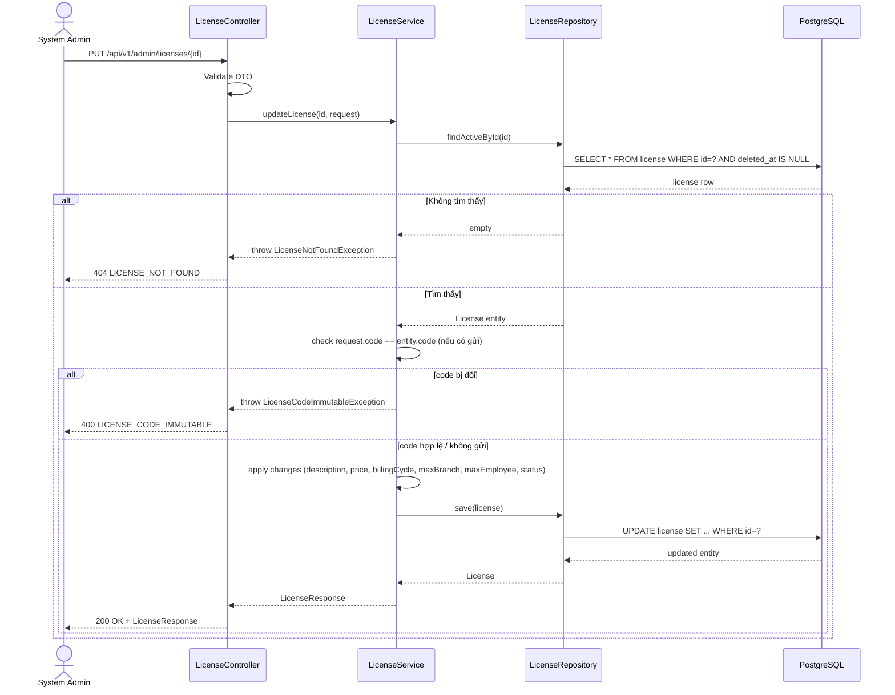
```mermaid
sequenceDiagram
    actor Admin as System Admin
    participant API as LicenseController
    participant SVC as LicenseService
    participant REPO as LicenseRepository
    participant DB as PostgreSQL

    Admin->>API: PUT /api/v1/admin/licenses/{id}
    API->>API: Validate DTO
    API->>SVC: updateLicense(id, request)
    SVC->>REPO: findActiveById(id)
    REPO->>DB: SELECT * FROM license WHERE id=? AND deleted_at IS NULL
    DB-->>REPO: license row
    alt Không tìm thấy
        REPO-->>SVC: empty
        SVC-->>API: throw LicenseNotFoundException
        API-->>Admin: 404 LICENSE_NOT_FOUND
    else Tìm thấy
        REPO-->>SVC: License entity
        SVC->>SVC: check request.code == entity.code (nếu có gửi)
        alt code bị đổi
            SVC-->>API: throw LicenseCodeImmutableException
            API-->>Admin: 400 LICENSE_CODE_IMMUTABLE
        else code hợp lệ / không gửi
            SVC->>SVC: apply changes (description, price, billingCycle, maxBranch, maxEmployee, status)
            SVC->>REPO: save(license)
            REPO->>DB: UPDATE license SET ... WHERE id=?
            DB-->>REPO: updated entity
            REPO-->>SVC: License
            SVC-->>API: LicenseResponse
            API-->>Admin: 200 OK + LicenseResponse
        end
    end
```

### 13. Activity Diagram

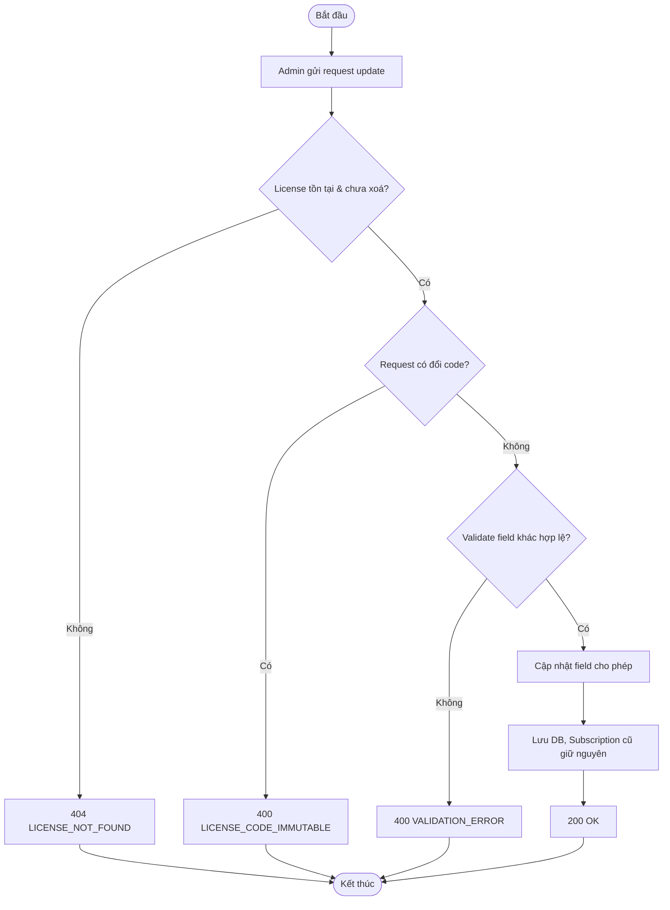
```mermaid
flowchart TD
    A([Bắt đầu]) --> B[Admin gửi request update]
    B --> C{License tồn tại & chưa xoá?}
    C -- Không --> D[404 LICENSE_NOT_FOUND]
    D --> Z([Kết thúc])
    C -- Có --> E{Request có đổi code?}
    E -- Có --> F[400 LICENSE_CODE_IMMUTABLE]
    F --> Z
    E -- Không --> G{Validate field khác hợp lệ?}
    G -- Không --> H[400 VALIDATION_ERROR]
    H --> Z
    G -- Có --> I[Cập nhật field cho phép]
    I --> J[Lưu DB, Subscription cũ giữ nguyên]
    J --> K[200 OK]
    K --> Z
```

### 14. Business Logic (Pseudo Code)

```text
FUNCTION updateLicense(id: UUID, request: UpdateLicenseRequest) -> LicenseResponse:
    // TODO: PERMISSION CHECK - ADMIN_LICENSE_UPDATE

    license = licenseRepository.findActiveById(id)
    IF license == NULL:
        THROW LicenseNotFoundException("License not found")

    IF request.code IS NOT NULL AND request.code != license.code:
        THROW LicenseCodeImmutableException("License code cannot be changed")

    VALIDATE request (Bean Validation)

    // Chỉ cập nhật các field được phép, KHÔNG đụng vào code, id, created_at
    license.description   = request.description
    license.price         = request.price
    license.billingCycle  = request.billingCycle
    license.maxBranch     = request.maxBranch
    license.maxEmployee   = request.maxEmployee
    license.status        = request.status
    license.updatedAt     = now()

    savedLicense = licenseRepository.save(license)

    // Business rule bắt buộc: KHÔNG chạm vào license_subscription tại đây
    // Subscription đã cấp giữ nguyên snapshot của nó.

    RETURN licenseMapper.toResponse(savedLicense)
END FUNCTION
```

### 15. Edge Cases

| Edge Case | Xử lý |
|---|---|
| Sửa `code` khác giá trị hiện tại | Từ chối `400 LICENSE_CODE_IMMUTABLE` |
| Gửi `code` giống hệt giá trị hiện tại | Cho phép qua (không coi là vi phạm vì không thực sự thay đổi) |
| Update License đã bị soft-delete (`deleted_at != NULL`) | Trả `404 LICENSE_NOT_FOUND` (vì query mặc định loại trừ deleted) |
| Update License đang có nhiều Subscription ACTIVE ở nhiều Organization | Cho phép, các Subscription không bị ảnh hưởng |
| Đổi `status` từ `ACTIVE` → `LOCKED` qua API Update | Cho phép về mặt kỹ thuật; Backend cần áp dụng cùng logic với UC-LIC-04 (không tạo Subscription mới từ License này sau khi LOCKED) |
| `price` giảm xuống 0 | Hợp lệ |
| Update không gửi field nào thay đổi thực sự (giá trị y hệt cũ) | Vẫn xử lý bình thường, `updated_at` vẫn được refresh |

### 16. Acceptance Criteria

- [ ] Update thành công các field: `description, price, billing_cycle, max_branch, max_employee, status`.
- [ ] `code` không bao giờ bị thay đổi qua API này.
- [ ] Gửi `code` khác giá trị hiện tại → `400 LICENSE_CODE_IMMUTABLE`.
- [ ] Update License không tồn tại / đã xoá → `404 LICENSE_NOT_FOUND`.
- [ ] Sau khi Update, mọi `License_Subscription` liên kết (ACTIVE/EXPIRED/REVOKED) giữ nguyên `price, billing_cycle, max_branch, max_employee` snapshot cũ — không bị đổi theo License mới.
- [ ] Validate field theo đúng rule (price >= 0, enum billing_cycle, max_branch/max_employee >= -1).

### 17. Test Scenarios

**Happy Path**
- TC-01: Update `price` và `description` hợp lệ → 200, dữ liệu được cập nhật.
- TC-02: Update `status` từ ACTIVE sang LOCKED → 200.

**Validation**
- TC-03: `price` âm → 400.
- TC-04: `billingCycle` = "DAILY" → 400.
- TC-05: `maxBranch` = -3 → 400.

**Boundary**
- TC-06: `price` = 0 → 200.
- TC-07: `maxEmployee` = -1 → 200 (Unlimited).

**Exception**
- TC-08: Update License không tồn tại (`id` random UUID) → 404.
- TC-09: Update License đã bị soft-delete → 404.
- TC-10: Gửi `code` khác giá trị hiện tại → 400 `LICENSE_CODE_IMMUTABLE`.

**Business Rule**
- TC-11: Sau khi update `price` của License, kiểm tra Subscription đã cấp trước đó (ACTIVE) — `price` của Subscription **không đổi**.
- TC-12: Sau khi update `maxBranch` của License, kiểm tra Subscription cũ vẫn giữ `maxBranch` snapshot ban đầu.

---

## UC-LIC-03: Delete License (Soft Delete)

### 1. Overview

| | |
|---|---|
| **Use Case ID** | UC-LIC-03 |
| **Use Case Name** | Delete License (Soft Delete) |
| **Description** | System Admin xoá mềm một License Plan. License vẫn tồn tại trong DB để phục vụ tham chiếu lịch sử cho các Subscription đã cấp, nhưng không còn xuất hiện trong danh sách License khả dụng. |
| **Actor** | System Admin |
| **Priority** | Medium |

### 2. Business Rules

- BR-01: Đây là **Soft Delete** — chỉ cập nhật `deleted_at = now()`, **không xoá vật lý** record.
- BR-02: Cho phép xoá License **ngay cả khi đã có Subscription** tham chiếu tới nó (vì Subscription dùng snapshot độc lập, không phụ thuộc License hiện tại).
- BR-03: Sau khi xoá, License không còn được dùng để cấp Subscription mới (tương tự nguyên tắc của LOCKED, nhưng ở đây là bị loại khỏi hệ thống hoàn toàn khỏi các danh sách/khả năng chọn).
- BR-04: Các Subscription đã cấp trước đó (ACTIVE/EXPIRED/REVOKED) tiếp tục hoạt động bình thường, không bị ảnh hưởng bởi việc xoá License gốc.

### 3. Preconditions

- Actor đã đăng nhập với vai trò System Admin.
- `// TODO: PERMISSION CHECK` — Actor có quyền `ADMIN_LICENSE_DELETE`.
- License với `id` tương ứng tồn tại và chưa bị soft-delete trước đó.

### 4. Postconditions

- `license.deleted_at` được set = thời điểm hiện tại.
- `license.updated_at` được cập nhật.
- Toàn bộ dữ liệu License vẫn còn nguyên vẹn trong DB (không mất field nào).
- Các `License_Subscription` liên quan không đổi.

### 5. Main Flow

1. System Admin gửi request `DELETE /api/v1/admin/licenses/{id}`.
2. Hệ thống tìm License theo `id` (loại trừ đã soft-delete).
3. Hệ thống set `deleted_at = now()`.
4. Hệ thống lưu thay đổi.
5. Hệ thống trả về `200 OK` (hoặc `204 No Content` tuỳ convention — tài liệu này chọn `200 OK` kèm thông báo để đồng bộ error envelope).

### 6. Alternative Flow

- Không có (đây là hành động đơn giản, không nhánh phụ đáng kể).

### 7. Exception Flow

- **EF-01**: License không tồn tại hoặc đã bị soft-delete trước đó → `404 Not Found`, error code `LICENSE_NOT_FOUND`.
- **EF-02**: Lỗi hệ thống → `500`, `INTERNAL_SERVER_ERROR`.

### 8. Validation Rules

| Field | Rule |
|---|---|
| `id` (path variable) | required, phải là UUID hợp lệ, phải tồn tại trong DB và `deleted_at IS NULL` |

Không có field body cần validate (DELETE không có request body).

### 9. Database Changes

| Table | Thao tác | Field bị thay đổi |
|---|---|---|
| `license` | UPDATE (soft delete) | `deleted_at, updated_at` |
| `license_subscription` | Không thay đổi | — |

### 10. API Design

**Method**: `DELETE`
**URL**: `/api/v1/admin/licenses/{id}`

**Headers**
```
Authorization: Bearer {jwt_token}
```

**Request**: Không có body.

**Response (200 OK)**
```json
{
  "success": true,
  "data": {
    "id": "b1e2c3d4-0000-0000-0000-000000000001",
    "deletedAt": "2026-07-23T12:00:00Z"
  },
  "error": null
}
```

**HTTP Status**: `200`, `404`, `401/403`, `500`
**Error Codes**: `LICENSE_NOT_FOUND`, `UNAUTHORIZED`, `FORBIDDEN`, `INTERNAL_SERVER_ERROR`

### 11. DTO Design

**Request DTO**: Không cần (path variable `id` là đủ).

**Response DTO — `DeleteLicenseResponse`**
```java
public class DeleteLicenseResponse {
    private UUID id;
    private Instant deletedAt;
}
```

### 12. Sequence Diagram

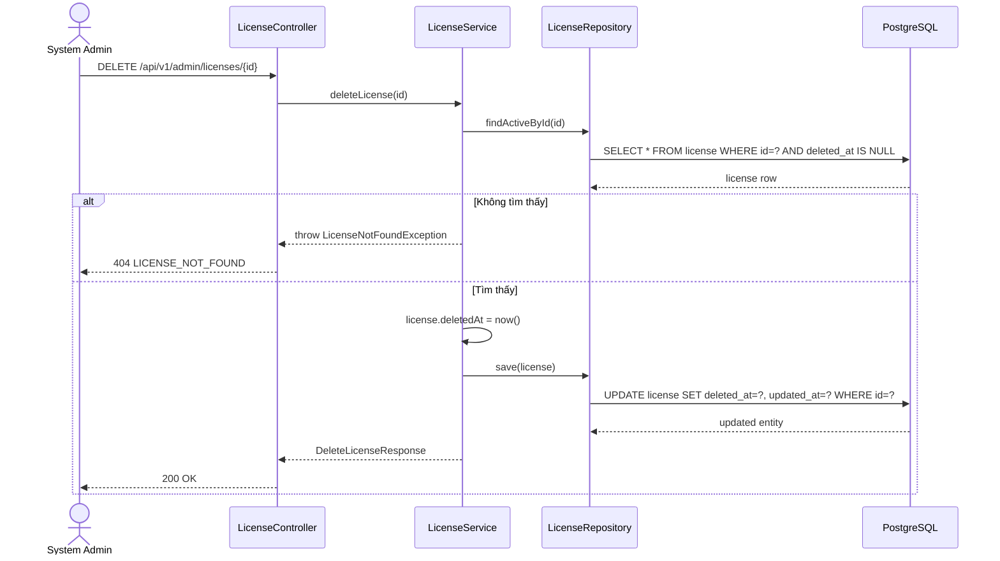
```mermaid
sequenceDiagram
    actor Admin as System Admin
    participant API as LicenseController
    participant SVC as LicenseService
    participant REPO as LicenseRepository
    participant DB as PostgreSQL

    Admin->>API: DELETE /api/v1/admin/licenses/{id}
    API->>SVC: deleteLicense(id)
    SVC->>REPO: findActiveById(id)
    REPO->>DB: SELECT * FROM license WHERE id=? AND deleted_at IS NULL
    DB-->>REPO: license row
    alt Không tìm thấy
        SVC-->>API: throw LicenseNotFoundException
        API-->>Admin: 404 LICENSE_NOT_FOUND
    else Tìm thấy
        SVC->>SVC: license.deletedAt = now()
        SVC->>REPO: save(license)
        REPO->>DB: UPDATE license SET deleted_at=?, updated_at=? WHERE id=?
        DB-->>REPO: updated entity
        SVC-->>API: DeleteLicenseResponse
        API-->>Admin: 200 OK
    end
```

### 13. Activity Diagram

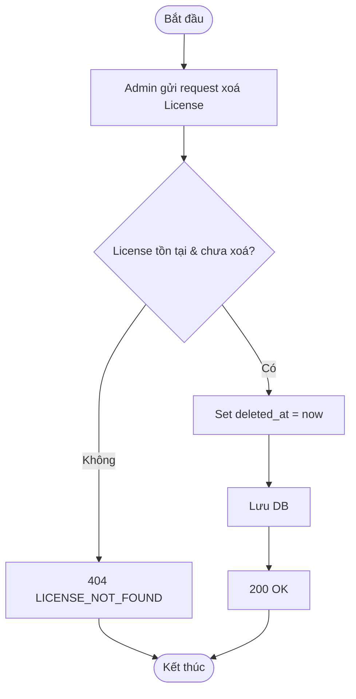
```mermaid
flowchart TD
    A([Bắt đầu]) --> B[Admin gửi request xoá License]
    B --> C{License tồn tại & chưa xoá?}
    C -- Không --> D[404 LICENSE_NOT_FOUND]
    D --> Z([Kết thúc])
    C -- Có --> E[Set deleted_at = now]
    E --> F[Lưu DB]
    F --> G[200 OK]
    G --> Z
```

### 14. Business Logic (Pseudo Code)

```text
FUNCTION deleteLicense(id: UUID) -> DeleteLicenseResponse:
    // TODO: PERMISSION CHECK - ADMIN_LICENSE_DELETE

    license = licenseRepository.findActiveById(id)
    IF license == NULL:
        THROW LicenseNotFoundException("License not found")

    license.deletedAt = now()
    license.updatedAt = now()

    licenseRepository.save(license)

    // Business rule bắt buộc: KHÔNG xoá / KHÔNG chỉnh sửa license_subscription
    // Các Subscription đã cấp tiếp tục hoạt động bình thường độc lập với License gốc.

    RETURN new DeleteLicenseResponse(id, license.deletedAt)
END FUNCTION
```

### 15. Edge Cases

| Edge Case | Xử lý |
|---|---|
| Deleted License (xoá License đã xoá rồi) | Trả `404 LICENSE_NOT_FOUND` (vì query mặc định loại trừ deleted) |
| License đang có nhiều Subscription ACTIVE ở nhiều Organization | Vẫn cho phép xoá bình thường, Subscription không đổi |
| License đang ở trạng thái `LOCKED` | Vẫn cho phép xoá bình thường (LOCKED và deleted là 2 khái niệm độc lập) |
| `id` không phải UUID hợp lệ | Trả `400 Bad Request` (lỗi parse path variable, xử lý ở tầng Controller/Exception Handler chung) |
| Xoá License rồi Renew Subscription của Organization đang dùng License đó | Vẫn cho phép Renew bình thường (xem UC-SUB-01) vì Renew chỉ thao tác trên `license_subscription`, không cần License gốc còn active |

### 16. Acceptance Criteria

- [ ] Xoá License thành công set `deleted_at` khác NULL, không xoá vật lý record.
- [ ] Xoá License đã có Subscription vẫn thành công, Subscription không bị ảnh hưởng.
- [ ] Xoá License không tồn tại → `404`.
- [ ] Xoá License đã bị xoá trước đó → `404`.
- [ ] Sau khi xoá, License không xuất hiện trong danh sách License khả dụng (danh sách mặc định loại trừ deleted).
- [ ] Toàn bộ field khác của License (`code, name, price`...) giữ nguyên sau khi soft-delete.

### 17. Test Scenarios

**Happy Path**
- TC-01: Xoá License hợp lệ, chưa có Subscription nào → 200, `deleted_at` được set.
- TC-02: Xoá License đã có 1 hoặc nhiều Subscription (ACTIVE/EXPIRED/REVOKED) → 200, Subscription giữ nguyên.

**Validation**
- TC-03: `id` không đúng định dạng UUID → 400.

**Boundary**
- (Không áp dụng nhiều cho use case này vì không có input numeric)

**Exception**
- TC-04: Xoá License không tồn tại → 404.
- TC-05: Xoá License đã bị xoá (gọi API xoá 2 lần liên tiếp) → lần 2 trả 404.

**Business Rule**
- TC-06: Sau khi xoá License, kiểm tra Subscription cũ (View License Detail — UC-SUB-03) vẫn hiển thị đầy đủ thông tin snapshot bình thường.
- TC-07: Sau khi xoá License, License không còn xuất hiện trong danh sách để Admin chọn cấp Subscription mới (liên quan tới Future Design — Grant License flow).

---

## UC-LIC-04: Lock License

### 1. Overview

| | |
|---|---|
| **Use Case ID** | UC-LIC-04 |
| **Use Case Name** | Lock License |
| **Description** | System Admin khoá một License Plan, ngăn không cho License đó được dùng để cấp Subscription mới, trong khi các Subscription đã cấp trước đó vẫn tiếp tục hoạt động bình thường. |
| **Actor** | System Admin |
| **Priority** | Medium |

### 2. Business Rules

- BR-01: Lock License chỉ cập nhật `status` của License thành `LOCKED`.
- BR-02: Không ảnh hưởng đến Subscription đang `ACTIVE` (không tự động Revoke/Expire).
- BR-03: Sau khi License bị `LOCKED`, **không được phép tạo Subscription mới** từ License này (ràng buộc này áp dụng tại UC cấp Subscription mới — Grant License, ngoài phạm vi 8 UC chính nhưng phải được Backend ghi nhớ khi implement flow cấp License).
- BR-04: Subscription cũ đã cấp từ License này (trước khi bị Lock) vẫn hoạt động bình thường, không bị Revoke hay Expire do việc Lock License.

### 3. Preconditions

- Actor đã đăng nhập với vai trò System Admin.
- `// TODO: PERMISSION CHECK` — Actor có quyền `ADMIN_LICENSE_LOCK`.
- License tồn tại, chưa bị soft-delete.
- License đang ở trạng thái `ACTIVE` (nếu đã `LOCKED` thì đây là Edge Case, xem mục 15).

### 4. Postconditions

- `license.status = LOCKED`.
- `license.updated_at` được cập nhật.
- Không có Subscription nào bị thay đổi.

### 5. Main Flow

1. System Admin gửi request `PATCH /api/v1/admin/licenses/{id}/lock`.
2. Hệ thống tìm License theo `id` (loại trừ đã soft-delete).
3. Hệ thống kiểm tra `status` hiện tại của License:
   - Nếu đang `ACTIVE` → chuyển thành `LOCKED`.
   - Nếu đã là `LOCKED` → xem Exception Flow.
4. Hệ thống lưu thay đổi.
5. Hệ thống trả về `200 OK` cùng dữ liệu License sau khi Lock.

### 6. Alternative Flow

- Không có nhánh phụ đáng kể ngoài luồng chính.

### 7. Exception Flow

- **EF-01**: License không tồn tại hoặc đã soft-delete → `404 Not Found`, error code `LICENSE_NOT_FOUND`.
- **EF-02**: License đã ở trạng thái `LOCKED` → `409 Conflict`, error code `LICENSE_ALREADY_LOCKED`.
- **EF-03**: Lỗi hệ thống → `500`, `INTERNAL_SERVER_ERROR`.

### 8. Validation Rules

| Field | Rule |
|---|---|
| `id` (path variable) | required, UUID hợp lệ, License phải tồn tại và chưa bị soft-delete |
| (Trạng thái hiện tại) | phải là `ACTIVE` để chuyển sang `LOCKED` — nếu không, trả lỗi nghiệp vụ tương ứng |

### 9. Database Changes

| Table | Thao tác | Field bị thay đổi |
|---|---|---|
| `license` | UPDATE | `status (ACTIVE → LOCKED), updated_at` |
| `license_subscription` | Không thay đổi | — |

### 10. API Design

**Method**: `PATCH`
**URL**: `/api/v1/admin/licenses/{id}/lock`

**Headers**
```
Authorization: Bearer {jwt_token}
```

**Request**: Không có body.

**Response (200 OK)**
```json
{
  "success": true,
  "data": {
    "id": "b1e2c3d4-0000-0000-0000-000000000001",
    "code": "PRO_PLAN",
    "status": "LOCKED",
    "updatedAt": "2026-07-23T13:00:00Z"
  },
  "error": null
}
```

**HTTP Status**: `200`, `404`, `409`, `401/403`, `500`
**Error Codes**: `LICENSE_NOT_FOUND`, `LICENSE_ALREADY_LOCKED`, `UNAUTHORIZED`, `FORBIDDEN`, `INTERNAL_SERVER_ERROR`

### 11. DTO Design

**Request DTO**: Không cần (path variable là đủ).

**Response DTO**: dùng chung `LicenseResponse` (xem UC-LIC-01, mục 11), hoặc rút gọn `LicenseStatusResponse`:
```java
public class LicenseStatusResponse {
    private UUID id;
    private String code;
    private LicenseStatus status;
    private Instant updatedAt;
}
```

### 12. Sequence Diagram

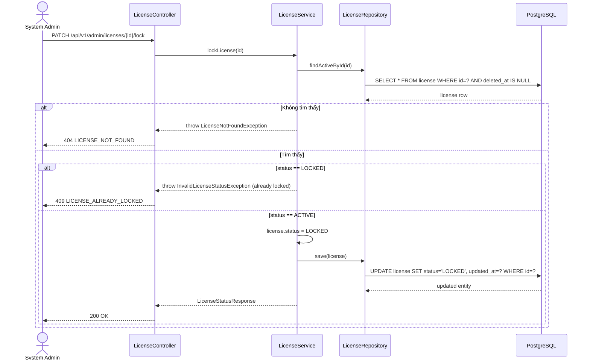
```mermaid
sequenceDiagram
    actor Admin as System Admin
    participant API as LicenseController
    participant SVC as LicenseService
    participant REPO as LicenseRepository
    participant DB as PostgreSQL

    Admin->>API: PATCH /api/v1/admin/licenses/{id}/lock
    API->>SVC: lockLicense(id)
    SVC->>REPO: findActiveById(id)
    REPO->>DB: SELECT * FROM license WHERE id=? AND deleted_at IS NULL
    DB-->>REPO: license row
    alt Không tìm thấy
        SVC-->>API: throw LicenseNotFoundException
        API-->>Admin: 404 LICENSE_NOT_FOUND
    else Tìm thấy
        alt status == LOCKED
            SVC-->>API: throw InvalidLicenseStatusException (already locked)
            API-->>Admin: 409 LICENSE_ALREADY_LOCKED
        else status == ACTIVE
            SVC->>SVC: license.status = LOCKED
            SVC->>REPO: save(license)
            REPO->>DB: UPDATE license SET status='LOCKED', updated_at=? WHERE id=?
            DB-->>REPO: updated entity
            SVC-->>API: LicenseStatusResponse
            API-->>Admin: 200 OK
        end
    end
```

### 13. Activity Diagram

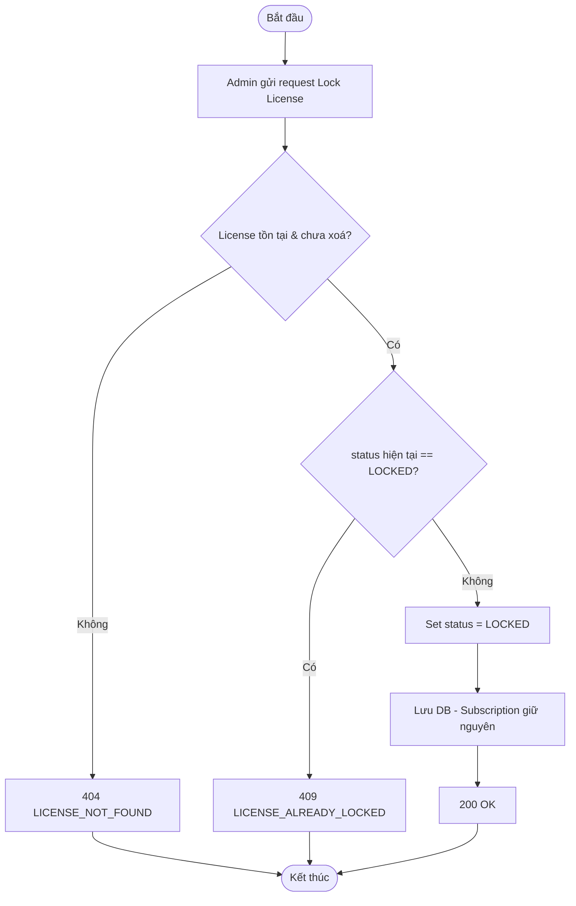
```mermaid
flowchart TD
    A([Bắt đầu]) --> B[Admin gửi request Lock License]
    B --> C{License tồn tại & chưa xoá?}
    C -- Không --> D[404 LICENSE_NOT_FOUND]
    D --> Z([Kết thúc])
    C -- Có --> E{status hiện tại == LOCKED?}
    E -- Có --> F[409 LICENSE_ALREADY_LOCKED]
    F --> Z
    E -- Không --> G[Set status = LOCKED]
    G --> H[Lưu DB - Subscription giữ nguyên]
    H --> I[200 OK]
    I --> Z
```

### 14. Business Logic (Pseudo Code)

```text
FUNCTION lockLicense(id: UUID) -> LicenseStatusResponse:
    // TODO: PERMISSION CHECK - ADMIN_LICENSE_LOCK

    license = licenseRepository.findActiveById(id)
    IF license == NULL:
        THROW LicenseNotFoundException("License not found")

    IF license.status == LicenseStatus.LOCKED:
        THROW InvalidLicenseStatusException("License is already locked")

    license.status = LicenseStatus.LOCKED
    license.updatedAt = now()

    licenseRepository.save(license)

    // Business rule: KHÔNG đụng vào license_subscription.
    // Ràng buộc "không cấp Subscription mới từ License LOCKED" được
    // enforce tại tầng Grant-License Service (ngoài phạm vi UC này),
    // bằng cách kiểm tra license.status == ACTIVE trước khi tạo Subscription mới.

    RETURN new LicenseStatusResponse(license.id, license.code, license.status, license.updatedAt)
END FUNCTION
```

### 15. Edge Cases

| Edge Case | Xử lý |
|---|---|
| Lock License đã LOCKED | Trả `409 LICENSE_ALREADY_LOCKED` |
| Lock License đã bị soft-delete | Trả `404 LICENSE_NOT_FOUND` |
| Lock License đang có Subscription ACTIVE ở nhiều Organization | Cho phép, các Subscription ACTIVE tiếp tục hoạt động bình thường |
| Sau khi Lock, cố gắng tạo Subscription mới từ License này (ở flow Grant License) | Phải bị chặn, trả lỗi `LICENSE_LOCKED_CANNOT_ISSUE` (409) tại flow đó |
| Lock License rồi Renew Subscription cũ của License đó | Vẫn cho phép Renew bình thường (Renew không tạo Subscription mới, chỉ update `end_date` của Subscription đã tồn tại — xem UC-SUB-01 BR) |

### 16. Acceptance Criteria

- [ ] Lock License ACTIVE thành công → `status = LOCKED`.
- [ ] Lock License đã LOCKED → `409 LICENSE_ALREADY_LOCKED`, không có thay đổi nào trong DB.
- [ ] Lock License không tồn tại → `404`.
- [ ] Sau khi Lock, tất cả Subscription liên quan (ACTIVE/EXPIRED/REVOKED) không bị thay đổi.
- [ ] Sau khi Lock, License không thể dùng để cấp Subscription mới (kiểm tra tại flow liên quan).

### 17. Test Scenarios

**Happy Path**
- TC-01: Lock License đang ACTIVE → 200, status=LOCKED.

**Validation**
- TC-02: `id` không đúng UUID format → 400.

**Boundary**
- (Không áp dụng — use case không có input numeric)

**Exception**
- TC-03: Lock License không tồn tại → 404.
- TC-04: Lock License đã LOCKED (gọi Lock 2 lần liên tiếp) → lần 2 trả 409 `LICENSE_ALREADY_LOCKED`.
- TC-05: Lock License đã bị soft-delete → 404.

**Business Rule**
- TC-06: Lock License đang có Subscription ACTIVE → Subscription vẫn ACTIVE, Organization vẫn login được bình thường (không liên quan Revoke).
- TC-07: Sau khi Lock License, thử tạo Subscription mới từ License đó (giả lập flow Grant License) → bị từ chối `LICENSE_LOCKED_CANNOT_ISSUE`.

---

## UC-LIC-05: Reactivate License

### 1. Overview

| | |
|---|---|
| **Use Case ID** | UC-LIC-05 |
| **Use Case Name** | Reactivate License |
| **Description** | System Admin chuyển một License đang ở trạng thái `LOCKED` trở lại `ACTIVE`, cho phép License đó được dùng để cấp Subscription mới trở lại. |
| **Actor** | System Admin |
| **Priority** | Medium |

### 2. Business Rules

- BR-01: Chỉ áp dụng với License đang ở trạng thái `LOCKED`.
- BR-02: Chuyển đổi trạng thái: `LOCKED → ACTIVE`.
- BR-03: Không có tác động gì tới các Subscription hiện có (chúng không bị Lock nên không cần "reactivate").

### 3. Preconditions

- Actor đã đăng nhập với vai trò System Admin.
- `// TODO: PERMISSION CHECK` — Actor có quyền `ADMIN_LICENSE_REACTIVATE` (có thể gộp chung quyền với `ADMIN_LICENSE_LOCK`).
- License tồn tại, chưa bị soft-delete, và đang ở trạng thái `LOCKED`.

### 4. Postconditions

- `license.status = ACTIVE`.
- `license.updated_at` được cập nhật.
- License có thể được dùng lại để cấp Subscription mới.

### 5. Main Flow

1. System Admin gửi request `PATCH /api/v1/admin/licenses/{id}/reactivate`.
2. Hệ thống tìm License theo `id` (loại trừ đã soft-delete).
3. Hệ thống kiểm tra `status` hiện tại:
   - Nếu là `LOCKED` → chuyển thành `ACTIVE`.
   - Nếu là `ACTIVE` → xem Exception Flow.
4. Hệ thống lưu thay đổi.
5. Hệ thống trả về `200 OK` cùng dữ liệu License sau khi Reactivate.

### 6. Alternative Flow

- Không có nhánh phụ đáng kể.

### 7. Exception Flow

- **EF-01**: License không tồn tại hoặc đã soft-delete → `404 Not Found`, `LICENSE_NOT_FOUND`.
- **EF-02**: License đang ở trạng thái `ACTIVE` (không phải LOCKED) → `409 Conflict`, error code `LICENSE_ALREADY_ACTIVE`.
- **EF-03**: Lỗi hệ thống → `500`, `INTERNAL_SERVER_ERROR`.

### 8. Validation Rules

| Field | Rule |
|---|---|
| `id` (path variable) | required, UUID hợp lệ, License phải tồn tại, chưa soft-delete |
| (Trạng thái hiện tại) | phải là `LOCKED` để chuyển sang `ACTIVE` |

### 9. Database Changes

| Table | Thao tác | Field bị thay đổi |
|---|---|---|
| `license` | UPDATE | `status (LOCKED → ACTIVE), updated_at` |
| `license_subscription` | Không thay đổi | — |

### 10. API Design

**Method**: `PATCH`
**URL**: `/api/v1/admin/licenses/{id}/reactivate`

**Headers**
```
Authorization: Bearer {jwt_token}
```

**Request**: Không có body.

**Response (200 OK)**
```json
{
  "success": true,
  "data": {
    "id": "b1e2c3d4-0000-0000-0000-000000000001",
    "code": "PRO_PLAN",
    "status": "ACTIVE",
    "updatedAt": "2026-07-23T14:00:00Z"
  },
  "error": null
}
```

**HTTP Status**: `200`, `404`, `409`, `401/403`, `500`
**Error Codes**: `LICENSE_NOT_FOUND`, `LICENSE_ALREADY_ACTIVE`, `UNAUTHORIZED`, `FORBIDDEN`, `INTERNAL_SERVER_ERROR`

### 11. DTO Design

**Request DTO**: Không cần (path variable là đủ).

**Response DTO**: dùng chung `LicenseStatusResponse` (xem UC-LIC-04, mục 11).

### 12. Sequence Diagram

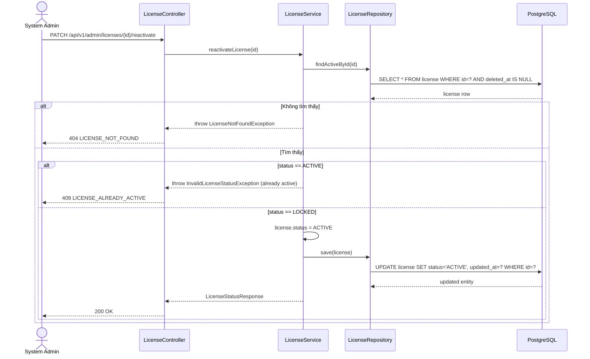
```mermaid
sequenceDiagram
    actor Admin as System Admin
    participant API as LicenseController
    participant SVC as LicenseService
    participant REPO as LicenseRepository
    participant DB as PostgreSQL

    Admin->>API: PATCH /api/v1/admin/licenses/{id}/reactivate
    API->>SVC: reactivateLicense(id)
    SVC->>REPO: findActiveById(id)
    REPO->>DB: SELECT * FROM license WHERE id=? AND deleted_at IS NULL
    DB-->>REPO: license row
    alt Không tìm thấy
        SVC-->>API: throw LicenseNotFoundException
        API-->>Admin: 404 LICENSE_NOT_FOUND
    else Tìm thấy
        alt status == ACTIVE
            SVC-->>API: throw InvalidLicenseStatusException (already active)
            API-->>Admin: 409 LICENSE_ALREADY_ACTIVE
        else status == LOCKED
            SVC->>SVC: license.status = ACTIVE
            SVC->>REPO: save(license)
            REPO->>DB: UPDATE license SET status='ACTIVE', updated_at=? WHERE id=?
            DB-->>REPO: updated entity
            SVC-->>API: LicenseStatusResponse
            API-->>Admin: 200 OK
        end
    end
```

### 13. Activity Diagram

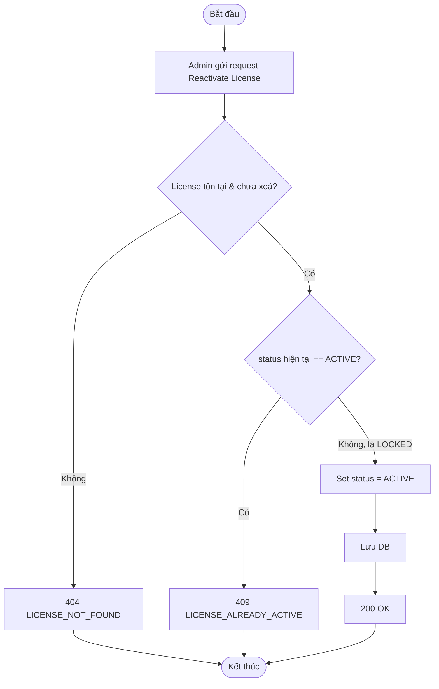
```mermaid
flowchart TD
    A([Bắt đầu]) --> B[Admin gửi request Reactivate License]
    B --> C{License tồn tại & chưa xoá?}
    C -- Không --> D[404 LICENSE_NOT_FOUND]
    D --> Z([Kết thúc])
    C -- Có --> E{status hiện tại == ACTIVE?}
    E -- Có --> F[409 LICENSE_ALREADY_ACTIVE]
    F --> Z
    E -- Không, là LOCKED --> G[Set status = ACTIVE]
    G --> H[Lưu DB]
    H --> I[200 OK]
    I --> Z
```

### 14. Business Logic (Pseudo Code)

```text
FUNCTION reactivateLicense(id: UUID) -> LicenseStatusResponse:
    // TODO: PERMISSION CHECK - ADMIN_LICENSE_REACTIVATE

    license = licenseRepository.findActiveById(id)
    IF license == NULL:
        THROW LicenseNotFoundException("License not found")

    IF license.status == LicenseStatus.ACTIVE:
        THROW InvalidLicenseStatusException("License is already active")

    license.status = LicenseStatus.ACTIVE
    license.updatedAt = now()

    licenseRepository.save(license)

    RETURN new LicenseStatusResponse(license.id, license.code, license.status, license.updatedAt)
END FUNCTION
```

### 15. Edge Cases

| Edge Case | Xử lý |
|---|---|
| Reactivate License đang ACTIVE (không phải LOCKED) | Trả `409 LICENSE_ALREADY_ACTIVE` |
| Reactivate License đã bị soft-delete | Trả `404 LICENSE_NOT_FOUND` |
| Reactivate License không tồn tại | Trả `404 LICENSE_NOT_FOUND` |
| Lock rồi Reactivate liên tục nhiều lần | Cho phép, mỗi lần đều là 1 giao dịch độc lập, không giới hạn số lần |

### 16. Acceptance Criteria

- [ ] Reactivate License đang LOCKED thành công → `status = ACTIVE`.
- [ ] Reactivate License đang ACTIVE → `409 LICENSE_ALREADY_ACTIVE`.
- [ ] Reactivate License không tồn tại → `404`.
- [ ] Sau khi Reactivate, License có thể dùng lại để cấp Subscription mới.

### 17. Test Scenarios

**Happy Path**
- TC-01: Reactivate License đang LOCKED → 200, status=ACTIVE.

**Validation**
- TC-02: `id` không đúng UUID format → 400.

**Boundary**
- (Không áp dụng)

**Exception**
- TC-03: Reactivate License không tồn tại → 404.
- TC-04: Reactivate License đang ACTIVE → 409 `LICENSE_ALREADY_ACTIVE`.
- TC-05: Reactivate License đã soft-delete → 404.

**Business Rule**
- TC-06: Lock License → Reactivate License → Lock lại → mỗi bước đều phản ánh đúng state machine, không có state lạ phát sinh.
- TC-07: Sau Reactivate, License xuất hiện lại trong danh sách License khả dụng để cấp Subscription mới.

---

## UC-SUB-00: Grant Subscription (Cấp License thủ công)

### 1. Overview

| | |
|---|---|
| **Use Case ID** | UC-SUB-00 |
| **Use Case Name** | Grant Subscription (Cấp License thủ công cho Organization) |
| **Description** | System Admin cấp một License Plan cho một Organization cụ thể bằng cách tạo mới một `License_Subscription`, snapshot lại toàn bộ thông tin thương mại của License tại thời điểm cấp. Đây là điểm khởi đầu vòng đời Subscription của một Organization, vì chưa tích hợp Payment nên hành động này do System Admin thực hiện thủ công. |
| **Actor** | System Admin |
| **Priority** | High |

> Ghi chú vị trí trong toàn bộ luồng nghiệp vụ: UC-SUB-00 là use case **tạo ra** `License_Subscription` đầu tiên (hoặc tiếp theo, sau khi Subscription trước đó đã EXPIRED/REVOKED) cho một Organization. UC-SUB-01 (Renew) chỉ thao tác trên Subscription đã tồn tại từ UC-SUB-00; UC-SUB-02 (Revoke) và UC-SUB-03 (View Detail) cũng thao tác trên dữ liệu do UC-SUB-00 sinh ra.

### 2. Business Rules

- BR-01: Một **Organization chỉ được có đúng một Subscription đang ACTIVE tại một thời điểm** (business invariant cốt lõi của toàn hệ thống — mục 2.1). Nếu Organization đã có Subscription ACTIVE, Grant mới **phải bị từ chối**.
- BR-02: License được chọn để cấp phải đang ở trạng thái `ACTIVE` (không phải `LOCKED`) và **chưa bị soft-delete** — đúng theo business rule đã nêu ở UC-LIC-04: *"Sau khi License bị LOCKED, không được phép tạo Subscription mới từ License này."* Rule này cũng áp dụng tương tự với License đã bị xoá mềm (vì License đã xoá không còn là lựa chọn khả dụng trong danh sách License đang cung cấp).
- BR-03: Khi tạo Subscription, hệ thống phải **snapshot** lại từ License gốc tại đúng thời điểm cấp các field: `price, billing_cycle, max_branch, max_employee`. Sau này nếu License gốc thay đổi, Subscription này không bị ảnh hưởng (đây là business rule bắt buộc xuyên suốt toàn bộ tài liệu — mục 2.1).
- BR-04: `status` mặc định khi tạo Subscription luôn là `ACTIVE`. Không nhận `status` từ client.
- BR-05: `start_date` mặc định là ngày hiện tại nếu client không truyền; có thể cho phép Admin chọn `start_date` trong tương lai (ví dụ cấp trước, có hiệu lực sau) — nếu vậy, `status` vẫn là `ACTIVE` ngay khi tạo theo đúng field mô tả trong DB Design gốc (tài liệu gốc không định nghĩa trạng thái "chờ kích hoạt", nên không tự suy diễn thêm trạng thái mới).
- BR-06: `end_date` được tính từ `start_date + billing_cycle` tại thời điểm cấp (30 ngày cho `MONTHLY`, 365 ngày cho `YEARLY`) — áp dụng cùng công thức quy đổi billing cycle đã dùng ở UC-SUB-01 (Renew), để đảm bảo tính nhất quán logic ngày tháng trong toàn hệ thống.
- BR-07: Chỉ System Admin được thực hiện Grant Subscription. Restaurant Owner không tự đăng ký được (vì chưa có Payment).

### 3. Preconditions

- Actor đã đăng nhập với vai trò System Admin.
- `// TODO: PERMISSION CHECK` — Actor có quyền `ADMIN_SUBSCRIPTION_GRANT`.
- Organization với `organization_id` tương ứng tồn tại.
- License với `license_id` tương ứng tồn tại, đang `ACTIVE`, chưa bị soft-delete.
- Organization chưa có Subscription nào đang ở trạng thái `ACTIVE`.

### 4. Postconditions

- Một record mới được tạo trong bảng `license_subscription` với `status = ACTIVE`, các field snapshot lấy đúng từ License tại thời điểm cấp.
- Organization giờ đây có đúng 1 Subscription ACTIVE (chính là Subscription vừa tạo).
- License gốc không bị thay đổi bởi hành động này.

### 5. Main Flow

1. System Admin gửi request `POST /api/v1/admin/subscriptions` với `organizationId`, `licenseId`, và tuỳ chọn `startDate`.
2. Hệ thống kiểm tra Organization tồn tại.
3. Hệ thống kiểm tra License tồn tại, đang `ACTIVE`, chưa soft-delete.
4. Hệ thống kiểm tra Organization **chưa có** Subscription nào đang `ACTIVE`.
5. Hệ thống tính `start_date` (mặc định = hôm nay nếu không truyền) và `end_date = start_date + billing_cycle` (theo `billing_cycle` của License tại thời điểm này).
6. Hệ thống snapshot `price, billing_cycle, max_branch, max_employee` từ License vào Subscription mới.
7. Hệ thống tạo record `License_Subscription` với `status = ACTIVE`.
8. Hệ thống trả về `201 Created` cùng dữ liệu Subscription vừa tạo.

### 6. Alternative Flow

- **AF-01**: Nếu client không truyền `startDate`, hệ thống tự động dùng ngày hiện tại làm `start_date`.

### 7. Exception Flow

- **EF-01**: Organization không tồn tại → `404 Not Found`, error code `ORGANIZATION_NOT_FOUND`.
- **EF-02**: License không tồn tại hoặc đã soft-delete → `404 Not Found`, error code `LICENSE_NOT_FOUND`.
- **EF-03**: License đang `LOCKED` → `409 Conflict`, error code `LICENSE_LOCKED_CANNOT_ISSUE`.
- **EF-04**: Organization đã có Subscription `ACTIVE` khác → `409 Conflict`, error code `ACTIVE_SUBSCRIPTION_EXISTS`.
- **EF-05**: Vi phạm Unique Index `uq_one_active_subscription_per_org` do race condition (2 request Grant đồng thời cho cùng 1 Organization) → bắt `DataIntegrityViolationException`, convert thành `409 ACTIVE_SUBSCRIPTION_EXISTS`.
- **EF-06**: Lỗi hệ thống → `500`, `INTERNAL_SERVER_ERROR`.

### 8. Validation Rules

| Field | Rule | Error Message |
|---|---|---|
| `organizationId` | required, UUID hợp lệ, phải tồn tại | "Organization is required" / "Organization not found" |
| `licenseId` | required, UUID hợp lệ, phải tồn tại, `status=ACTIVE`, `deleted_at IS NULL` | "License is required" / "License not found" / "License is locked and cannot be issued" |
| `startDate` | optional, date, nếu có thì không được là ngày trong quá khứ xa (đề xuất: `>= hôm nay`, cần BA xác nhận nếu cho phép cấp hồi tố) | "Start date must not be in the past" |
| (Ràng buộc nghiệp vụ) | Organization không được có Subscription `ACTIVE` khác | "Organization already has an active subscription" |

### 9. Database Changes

| Table | Thao tác | Field bị thay đổi |
|---|---|---|
| `license_subscription` | INSERT | `id, license_id, organization_id, start_date, end_date, status(=ACTIVE), price, billing_cycle, max_branch, max_employee, created_at, updated_at` |
| `license` | Không thay đổi | — |

### 10. API Design

**Method**: `POST`
**URL**: `/api/v1/admin/subscriptions`

**Headers**
```
Authorization: Bearer {jwt_token}
Content-Type: application/json
```

**Request**
```json
{
  "organizationId": "a9b8c7d6-0000-0000-0000-000000000099",
  "licenseId": "b1e2c3d4-0000-0000-0000-000000000001",
  "startDate": "2026-07-23"
}
```

**Response (201 Created)**
```json
{
  "success": true,
  "data": {
    "id": "c2d3e4f5-0000-0000-0000-000000000010",
    "licenseId": "b1e2c3d4-0000-0000-0000-000000000001",
    "organizationId": "a9b8c7d6-0000-0000-0000-000000000099",
    "startDate": "2026-07-23",
    "endDate": "2026-08-22",
    "status": "ACTIVE",
    "price": 990000,
    "billingCycle": "MONTHLY",
    "maxBranch": 5,
    "maxEmployee": 50,
    "createdAt": "2026-07-23T10:00:00Z",
    "updatedAt": "2026-07-23T10:00:00Z"
  },
  "error": null
}
```

**HTTP Status**
- `201 Created` — thành công
- `400 Bad Request` — validation lỗi
- `404 Not Found` — Organization/License không tồn tại
- `409 Conflict` — License LOCKED hoặc Organization đã có Subscription ACTIVE
- `401/403` — auth/permission
- `500` — lỗi hệ thống

**Error Codes**: `VALIDATION_ERROR`, `ORGANIZATION_NOT_FOUND`, `LICENSE_NOT_FOUND`, `LICENSE_LOCKED_CANNOT_ISSUE`, `ACTIVE_SUBSCRIPTION_EXISTS`, `UNAUTHORIZED`, `FORBIDDEN`, `INTERNAL_SERVER_ERROR`

### 11. DTO Design

**Request DTO — `GrantSubscriptionRequest`**
```java
public class GrantSubscriptionRequest {

    @NotNull(message = "Organization is required")
    private UUID organizationId;

    @NotNull(message = "License is required")
    private UUID licenseId;

    /** Optional; nếu null, service sẽ set = LocalDate.now() */
    private LocalDate startDate;
}
```

**Response DTO**: dùng chung `SubscriptionResponse` (xem UC-SUB-01, mục 11).

### 12. Sequence Diagram

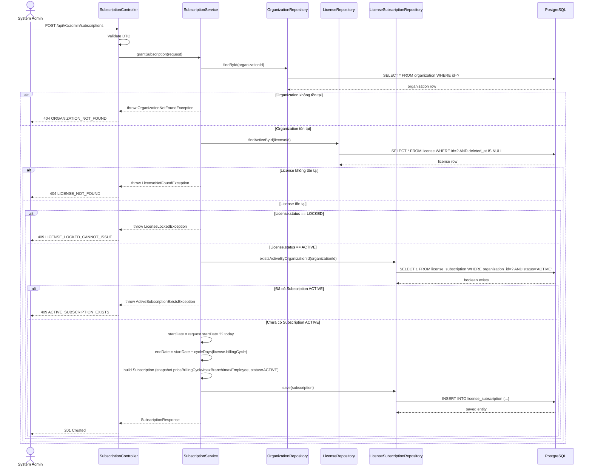
```mermaid
sequenceDiagram
    actor Admin as System Admin
    participant API as SubscriptionController
    participant SVC as SubscriptionService
    participant OREPO as OrganizationRepository
    participant LREPO as LicenseRepository
    participant SREPO as LicenseSubscriptionRepository
    participant DB as PostgreSQL

    Admin->>API: POST /api/v1/admin/subscriptions
    API->>API: Validate DTO
    API->>SVC: grantSubscription(request)
    SVC->>OREPO: findById(organizationId)
    OREPO->>DB: SELECT * FROM organization WHERE id=?
    DB-->>OREPO: organization row
    alt Organization không tồn tại
        SVC-->>API: throw OrganizationNotFoundException
        API-->>Admin: 404 ORGANIZATION_NOT_FOUND
    else Organization tồn tại
        SVC->>LREPO: findActiveById(licenseId)
        LREPO->>DB: SELECT * FROM license WHERE id=? AND deleted_at IS NULL
        DB-->>LREPO: license row
        alt License không tồn tại
            SVC-->>API: throw LicenseNotFoundException
            API-->>Admin: 404 LICENSE_NOT_FOUND
        else License tồn tại
            alt License.status == LOCKED
                SVC-->>API: throw LicenseLockedException
                API-->>Admin: 409 LICENSE_LOCKED_CANNOT_ISSUE
            else License.status == ACTIVE
                SVC->>SREPO: existsActiveByOrganizationId(organizationId)
                SREPO->>DB: SELECT 1 FROM license_subscription WHERE organization_id=? AND status='ACTIVE'
                DB-->>SREPO: boolean exists
                alt Đã có Subscription ACTIVE
                    SVC-->>API: throw ActiveSubscriptionExistsException
                    API-->>Admin: 409 ACTIVE_SUBSCRIPTION_EXISTS
                else Chưa có Subscription ACTIVE
                    SVC->>SVC: startDate = request.startDate ?? today
                    SVC->>SVC: endDate = startDate + cycleDays(license.billingCycle)
                    SVC->>SVC: build Subscription (snapshot price/billingCycle/maxBranch/maxEmployee, status=ACTIVE)
                    SVC->>SREPO: save(subscription)
                    SREPO->>DB: INSERT INTO license_subscription (...)
                    DB-->>SREPO: saved entity
                    SVC-->>API: SubscriptionResponse
                    API-->>Admin: 201 Created
                end
            end
        end
    end
```

### 13. Activity Diagram

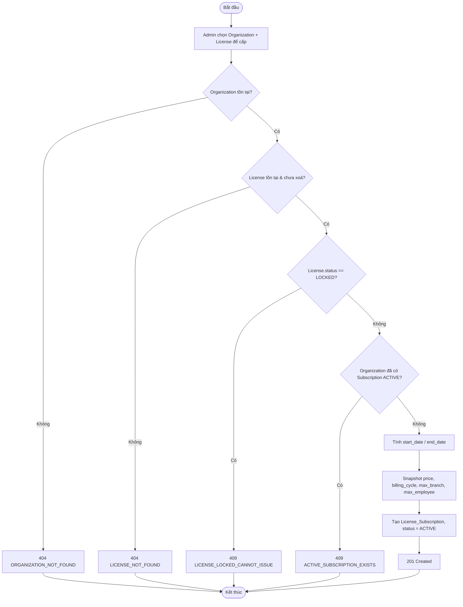
```mermaid
flowchart TD
    A([Bắt đầu]) --> B[Admin chọn Organization + License để cấp]
    B --> C{Organization tồn tại?}
    C -- Không --> D[404 ORGANIZATION_NOT_FOUND]
    D --> Z([Kết thúc])
    C -- Có --> E{License tồn tại & chưa xoá?}
    E -- Không --> F[404 LICENSE_NOT_FOUND]
    F --> Z
    E -- Có --> G{License.status == LOCKED?}
    G -- Có --> H[409 LICENSE_LOCKED_CANNOT_ISSUE]
    H --> Z
    G -- Không --> I{Organization đã có Subscription ACTIVE?}
    I -- Có --> J[409 ACTIVE_SUBSCRIPTION_EXISTS]
    J --> Z
    I -- Không --> K["Tính start_date / end_date"]
    K --> L["Snapshot price, billing_cycle, max_branch, max_employee"]
    L --> M["Tạo License_Subscription, status = ACTIVE"]
    M --> N[201 Created]
    N --> Z
```

### 14. Business Logic (Pseudo Code)

```text
FUNCTION grantSubscription(request: GrantSubscriptionRequest) -> SubscriptionResponse:
    // TODO: PERMISSION CHECK - ADMIN_SUBSCRIPTION_GRANT

    organization = organizationRepository.findById(request.organizationId)
    IF organization == NULL:
        THROW OrganizationNotFoundException("Organization not found")

    license = licenseRepository.findActiveById(request.licenseId)
    IF license == NULL:
        THROW LicenseNotFoundException("License not found")

    IF license.status == LicenseStatus.LOCKED:
        THROW LicenseLockedException("License is locked and cannot be issued")

    IF subscriptionRepository.existsActiveByOrganizationId(request.organizationId):
        THROW ActiveSubscriptionExistsException("Organization already has an active subscription")

    startDate = request.startDate IS NOT NULL ? request.startDate : LocalDate.now()
    cycleDays = (license.billingCycle == BillingCycle.MONTHLY) ? 30 : 365
    endDate = startDate.plusDays(cycleDays)

    subscription = NEW LicenseSubscription()
    subscription.licenseId       = license.id
    subscription.organizationId  = organization.id
    subscription.startDate       = startDate
    subscription.endDate         = endDate
    subscription.status          = SubscriptionStatus.ACTIVE   // luôn ép cứng
    subscription.price           = license.price               // snapshot
    subscription.billingCycle    = license.billingCycle         // snapshot
    subscription.maxBranch       = license.maxBranch             // snapshot
    subscription.maxEmployee     = license.maxEmployee           // snapshot

    savedSubscription = subscriptionRepository.save(subscription)
    // Unique Index uq_one_active_subscription_per_org là tuyến phòng thủ cuối cùng
    // cho race condition; nếu vi phạm, bắt DataIntegrityViolationException tại đây
    // và convert thành ActiveSubscriptionExistsException.

    RETURN subscriptionMapper.toResponse(savedSubscription)
END FUNCTION
```

### 15. Edge Cases

| Edge Case | Xử lý |
|---|---|
| Organization đã có Subscription ACTIVE | Từ chối `409 ACTIVE_SUBSCRIPTION_EXISTS` |
| License đang LOCKED | Từ chối `409 LICENSE_LOCKED_CANNOT_ISSUE` |
| License đã bị soft-delete | Từ chối `404 LICENSE_NOT_FOUND` (vì `findActiveById` loại trừ deleted) |
| Organization không tồn tại | Từ chối `404 ORGANIZATION_NOT_FOUND` |
| 2 request Grant gửi đồng thời cho cùng 1 Organization (race condition) | Unique Index DB chặn 1 trong 2, request thua bị convert thành `409 ACTIVE_SUBSCRIPTION_EXISTS` |
| Organization từng có Subscription EXPIRED/REVOKED trước đó (không có Subscription ACTIVE hiện tại) | Cho phép Grant mới bình thường — tạo thêm 1 record `license_subscription` mới, các record cũ giữ nguyên làm lịch sử |
| Không truyền `startDate` | Mặc định `start_date = hôm nay` |
| Truyền `startDate` trong tương lai | Cho phép tạo với `status=ACTIVE` ngay (theo đúng field DB gốc, không có trạng thái "chờ kích hoạt" được định nghĩa) — cần BA xác nhận thêm nếu muốn giới hạn |
| Truyền `status` trong request | Bị bỏ qua hoàn toàn (DTO không có field `status`), luôn set `ACTIVE` |

### 16. Acceptance Criteria

- [ ] Grant Subscription thành công tạo đúng 1 record `license_subscription` mới với `status=ACTIVE`.
- [ ] Các field `price, billingCycle, maxBranch, maxEmployee` được snapshot đúng từ License tại thời điểm cấp.
- [ ] `end_date` được tính đúng theo `start_date + billing_cycle` (30 ngày MONTHLY / 365 ngày YEARLY).
- [ ] Grant Subscription cho Organization đã có Subscription ACTIVE bị từ chối `409 ACTIVE_SUBSCRIPTION_EXISTS`.
- [ ] Grant Subscription từ License đang LOCKED bị từ chối `409 LICENSE_LOCKED_CANNOT_ISSUE`.
- [ ] Grant Subscription từ License đã soft-delete bị từ chối `404 LICENSE_NOT_FOUND`.
- [ ] Grant Subscription cho Organization không tồn tại bị từ chối `404 ORGANIZATION_NOT_FOUND`.
- [ ] Race condition tạo đồng thời 2 Subscription ACTIVE cho cùng Organization chỉ 1 request thành công.
- [ ] Sau khi Grant thành công, sửa License gốc (UC-LIC-02) không làm thay đổi Subscription vừa tạo.

### 17. Test Scenarios

**Happy Path**
- TC-01: Grant Subscription hợp lệ cho Organization chưa có Subscription nào → 201, status=ACTIVE, snapshot đúng.
- TC-02: Grant Subscription cho Organization đã từng có Subscription EXPIRED trước đó → 201 (tạo thêm record mới).
- TC-03: Grant Subscription không truyền `startDate` → 201, `start_date` = hôm nay.

**Validation**
- TC-04: Thiếu `organizationId` → 400.
- TC-05: Thiếu `licenseId` → 400.
- TC-06: `organizationId` không đúng UUID format → 400.

**Boundary**
- TC-07: `startDate` = hôm nay chính xác → 201, `end_date` tính đúng từ hôm nay.
- TC-08: License có `billingCycle=YEARLY` → `end_date = start_date + 365 ngày`.

**Exception**
- TC-09: Organization không tồn tại → 404 `ORGANIZATION_NOT_FOUND`.
- TC-10: License không tồn tại → 404 `LICENSE_NOT_FOUND`.
- TC-11: License đã soft-delete → 404 `LICENSE_NOT_FOUND`.
- TC-12: License đang LOCKED → 409 `LICENSE_LOCKED_CANNOT_ISSUE`.
- TC-13: Organization đã có Subscription ACTIVE → 409 `ACTIVE_SUBSCRIPTION_EXISTS`.

**Business Rule**
- TC-14: Grant Subscription thành công, sau đó Admin sửa `price` của License gốc (UC-LIC-02) → Subscription vừa tạo vẫn giữ `price` snapshot cũ.
- TC-15: Gửi đồng thời 2 request Grant cho cùng 1 Organization (giả lập race condition) → chỉ 1 request thành công, request còn lại nhận `409 ACTIVE_SUBSCRIPTION_EXISTS`.
- TC-16: Grant Subscription rồi Revoke (UC-SUB-02), sau đó Grant lại License khác cho cùng Organization → cho phép, vì Organization không còn Subscription ACTIVE nào.

---

## UC-SUB-01: Renew Subscription

### 1. Overview

| | |
|---|---|
| **Use Case ID** | UC-SUB-01 |
| **Use Case Name** | Renew Subscription |
| **Description** | System Admin gia hạn một License Subscription hiện có cho Organization, bằng cách kéo dài `end_date`. Đây KHÔNG phải hành động tạo Subscription mới. |
| **Actor** | System Admin (Restaurant Owner **chưa** được phép tự Renew ở Phase hiện tại) |
| **Priority** | High |

### 2. Business Rules

- BR-01: Renew **không tạo Subscription mới** — chỉ cập nhật `end_date` của Subscription hiện có.
- BR-02: Nếu Subscription còn hạn (`end_date >= current_date` và `status == ACTIVE`):
  `new_end_date = old_end_date + billing_cycle`
- BR-03: Nếu Subscription đã hết hạn (`end_date < current_date`, tương ứng `status == EXPIRED` hoặc sắp được xác định là expired):
  `new_end_date = current_date + billing_cycle`
- BR-04: Quy đổi `billing_cycle`:
   - `MONTHLY` → cộng thêm **30 ngày**.
   - `YEARLY` → cộng thêm **365 ngày**.
- BR-05: Có thể Renew **nhiều lần liên tiếp**, không giới hạn số lần.
- BR-06: `billing_cycle` dùng để tính toán là `billing_cycle` **đang lưu trên chính Subscription đó** (snapshot), KHÔNG lấy từ License gốc hiện hành (vì License có thể đã bị sửa/xoá).
- BR-07: Chỉ System Admin được thực hiện Renew. Restaurant Owner tự gia hạn là ngoài phạm vi (chưa hỗ trợ).
- BR-08: Sau khi Renew một Subscription đang `EXPIRED`, `status` của Subscription phải được chuyển lại thành `ACTIVE` (vì mục đích của Renew là khôi phục hiệu lực sử dụng). *(Suy luận tối thiểu cần thiết để nghiệp vụ nhất quán: nếu không chuyển lại ACTIVE, Organization vẫn không login được dù đã gia hạn — điều này trái với mục đích nghiệp vụ của chức năng Renew. Đây là điểm Backend cần xác nhận thêm với BA nếu có nghiệp vụ khác dự kiến.)*
- BR-09: Renew **không** được áp dụng cho Subscription đang ở trạng thái `REVOKED` — vì REVOKED là hành động chủ động thu hồi bởi Admin, không phải do hết hạn tự nhiên. Renew một Subscription REVOKED phải bị từ chối (xem Exception Flow).

### 3. Preconditions

- Actor đã đăng nhập với vai trò System Admin.
- `// TODO: PERMISSION CHECK` — Actor có quyền `ADMIN_SUBSCRIPTION_RENEW`.
- Subscription với `id` tương ứng tồn tại.
- Subscription không ở trạng thái `REVOKED`.

### 4. Postconditions

- `license_subscription.end_date` được cập nhật theo công thức BR-02/BR-03.
- Nếu Subscription trước đó là `EXPIRED`, sau Renew chuyển thành `ACTIVE`.
- Nếu Subscription trước đó là `ACTIVE`, giữ nguyên `ACTIVE`.
- `license_subscription.updated_at` được cập nhật.
- Không tạo thêm bất kỳ record `license_subscription` nào mới.

### 5. Main Flow

1. System Admin gửi request `POST /api/v1/admin/subscriptions/{id}/renew`.
2. Hệ thống tìm Subscription theo `id`.
3. Hệ thống kiểm tra `status` hiện tại của Subscription (không được là `REVOKED`).
4. Hệ thống xác định Subscription còn hạn hay đã hết hạn:
   - So sánh `end_date` với `current_date`.
5. Hệ thống tính `new_end_date` theo đúng công thức tương ứng (BR-02 hoặc BR-03), dựa trên `billing_cycle` snapshot của Subscription.
6. Hệ thống cập nhật `end_date = new_end_date`.
7. Nếu trạng thái trước đó là `EXPIRED`, hệ thống chuyển `status = ACTIVE`.
8. Hệ thống lưu thay đổi.
9. Hệ thống trả về `200 OK` cùng dữ liệu Subscription sau khi Renew.

### 6. Alternative Flow

- **AF-01**: Subscription đang `ACTIVE` và còn hạn dài (ví dụ còn 300 ngày) → vẫn cộng dồn thêm đúng 1 chu kỳ kể từ `old_end_date`, không giới hạn tổng thời hạn tối đa (theo yêu cầu gốc: "Có thể renew nhiều lần. Không giới hạn.").

### 7. Exception Flow

- **EF-01**: Subscription không tồn tại → `404 Not Found`, error code `SUBSCRIPTION_NOT_FOUND`.
- **EF-02**: Subscription đang `REVOKED` → `409 Conflict`, error code `SUBSCRIPTION_ALREADY_REVOKED` (không cho renew Subscription đã bị thu hồi).
- **EF-03**: Lỗi hệ thống → `500`, `INTERNAL_SERVER_ERROR`.

### 8. Validation Rules

| Field | Rule |
|---|---|
| `id` (path variable) | required, UUID hợp lệ, Subscription phải tồn tại |
| (Trạng thái hiện tại) | không được là `REVOKED` |
| `billing_cycle` (đọc từ Subscription) | phải là `MONTHLY` hoặc `YEARLY` để xác định số ngày cộng thêm (dữ liệu này luôn hợp lệ vì đã được validate khi tạo Subscription) |

### 9. Database Changes

| Table | Thao tác | Field bị thay đổi |
|---|---|---|
| `license_subscription` | UPDATE | `end_date, status (nếu từ EXPIRED → ACTIVE), updated_at` |
| `license` | Không thay đổi | — |

### 10. API Design

**Method**: `POST`
**URL**: `/api/v1/admin/subscriptions/{id}/renew`

**Headers**
```
Authorization: Bearer {jwt_token}
```

**Request**: Không có body (Renew luôn dùng đúng `billing_cycle` snapshot hiện tại của Subscription, không cho phép client truyền tuỳ ý để tránh sai lệch nghiệp vụ).

**Response (200 OK)**
```json
{
   "success": true,
   "data": {
      "id": "c2d3e4f5-0000-0000-0000-000000000010",
      "licenseId": "b1e2c3d4-0000-0000-0000-000000000001",
      "organizationId": "a9b8c7d6-0000-0000-0000-000000000099",
      "startDate": "2026-01-01",
      "endDate": "2026-08-22",
      "status": "ACTIVE",
      "price": 990000,
      "billingCycle": "MONTHLY",
      "maxBranch": 5,
      "maxEmployee": 50,
      "updatedAt": "2026-07-23T15:00:00Z"
   },
   "error": null
}
```

**HTTP Status**: `200`, `404`, `409`, `401/403`, `500`
**Error Codes**: `SUBSCRIPTION_NOT_FOUND`, `SUBSCRIPTION_ALREADY_REVOKED`, `UNAUTHORIZED`, `FORBIDDEN`, `INTERNAL_SERVER_ERROR`

### 11. DTO Design

**Request DTO**: Không cần (path variable là đủ; không nhận input từ client cho phép logic date luôn nhất quán, tránh sai lệch nghiệp vụ).

**Response DTO — `SubscriptionResponse`**
```java
public class SubscriptionResponse {
   private UUID id;
   private UUID licenseId;
   private UUID organizationId;
   private LocalDate startDate;
   private LocalDate endDate;
   private SubscriptionStatus status;
   private BigDecimal price;
   private BillingCycle billingCycle;
   private Integer maxBranch;
   private Integer maxEmployee;
   private Instant updatedAt;
}
```

### 12. Sequence Diagram

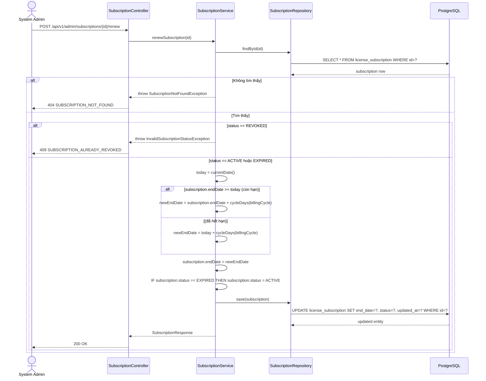
```mermaid
sequenceDiagram
   actor Admin as System Admin
   participant API as SubscriptionController
   participant SVC as SubscriptionService
   participant REPO as SubscriptionRepository
   participant DB as PostgreSQL

   Admin->>API: POST /api/v1/admin/subscriptions/{id}/renew
   API->>SVC: renewSubscription(id)
   SVC->>REPO: findById(id)
   REPO->>DB: SELECT * FROM license_subscription WHERE id=?
   DB-->>REPO: subscription row
   alt Không tìm thấy
      SVC-->>API: throw SubscriptionNotFoundException
      API-->>Admin: 404 SUBSCRIPTION_NOT_FOUND
   else Tìm thấy
      alt status == REVOKED
         SVC-->>API: throw InvalidSubscriptionStatusException
         API-->>Admin: 409 SUBSCRIPTION_ALREADY_REVOKED
      else status == ACTIVE hoặc EXPIRED
         SVC->>SVC: today = currentDate()
         alt subscription.endDate >= today  (còn hạn)
            SVC->>SVC: newEndDate = subscription.endDate + cycleDays(billingCycle)
         else  (đã hết hạn)
            SVC->>SVC: newEndDate = today + cycleDays(billingCycle)
         end
         SVC->>SVC: subscription.endDate = newEndDate
         SVC->>SVC: IF subscription.status == EXPIRED THEN subscription.status = ACTIVE
         SVC->>REPO: save(subscription)
         REPO->>DB: UPDATE license_subscription SET end_date=?, status=?, updated_at=? WHERE id=?
         DB-->>REPO: updated entity
         SVC-->>API: SubscriptionResponse
         API-->>Admin: 200 OK
      end
   end
```

### 13. Activity Diagram

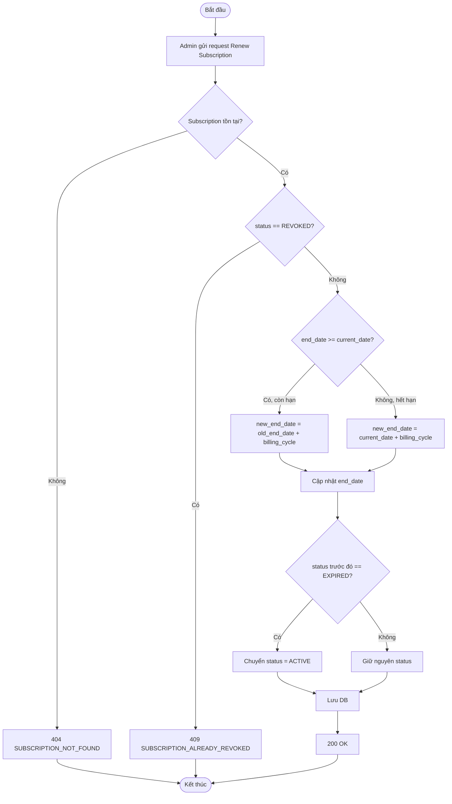
```mermaid
flowchart TD
   A([Bắt đầu]) --> B[Admin gửi request Renew Subscription]
   B --> C{Subscription tồn tại?}
   C -- Không --> D[404 SUBSCRIPTION_NOT_FOUND]
   D --> Z([Kết thúc])
   C -- Có --> E{status == REVOKED?}
   E -- Có --> F[409 SUBSCRIPTION_ALREADY_REVOKED]
   F --> Z
   E -- Không --> G{end_date >= current_date?}
   G -- Có, còn hạn --> H["new_end_date = old_end_date + billing_cycle"]
   G -- Không, hết hạn --> I["new_end_date = current_date + billing_cycle"]
   H --> J[Cập nhật end_date]
   I --> J
   J --> K{status trước đó == EXPIRED?}
   K -- Có --> L[Chuyển status = ACTIVE]
   K -- Không --> M[Giữ nguyên status]
   L --> N[Lưu DB]
   M --> N
   N --> O[200 OK]
   O --> Z
```

### 14. Business Logic (Pseudo Code)

```text
FUNCTION renewSubscription(id: UUID) -> SubscriptionResponse:
    // TODO: PERMISSION CHECK - ADMIN_SUBSCRIPTION_RENEW

    subscription = subscriptionRepository.findById(id)
    IF subscription == NULL:
        THROW SubscriptionNotFoundException("Subscription not found")

    IF subscription.status == SubscriptionStatus.REVOKED:
        THROW InvalidSubscriptionStatusException("Cannot renew a revoked subscription")

    today = LocalDate.now()
    cycleDays = (subscription.billingCycle == BillingCycle.MONTHLY) ? 30 : 365

    IF subscription.endDate >= today:
        // Còn hạn: cộng dồn thêm 1 chu kỳ kể từ ngày hết hạn cũ
        newEndDate = subscription.endDate.plusDays(cycleDays)
    ELSE:
        // Đã hết hạn: tính lại từ ngày hiện tại
        newEndDate = today.plusDays(cycleDays)

    subscription.endDate = newEndDate

    IF subscription.status == SubscriptionStatus.EXPIRED:
        subscription.status = SubscriptionStatus.ACTIVE

    subscription.updatedAt = now()

    savedSubscription = subscriptionRepository.save(subscription)

    RETURN subscriptionMapper.toResponse(savedSubscription)
END FUNCTION
```

### 15. Edge Cases

| Edge Case | Xử lý |
|---|---|
| Renew Subscription đã hết hạn (EXPIRED) | `new_end_date = current_date + billing_cycle`, đồng thời chuyển `status: EXPIRED → ACTIVE` |
| Renew Subscription đang còn hạn (ACTIVE) | `new_end_date = old_end_date + billing_cycle`, `status` giữ nguyên `ACTIVE` |
| Renew Subscription đã REVOKED | Từ chối, `409 SUBSCRIPTION_ALREADY_REVOKED` |
| Renew liên tục nhiều lần (ví dụ Renew 3 lần liên tiếp trong cùng ngày khi còn hạn) | Mỗi lần cộng dồn thêm đúng 1 chu kỳ kể từ `end_date` mới nhất — không giới hạn số lần theo yêu cầu gốc |
| Subscription có `end_date == current_date` (hết hạn đúng ngày hôm nay) | Theo công thức BR-02, điều kiện "còn hạn" là `end_date >= current_date` → coi là còn hạn, cộng từ `old_end_date`. *(Boundary case — cần Backend áp dụng nhất quán operator `>=` theo đúng câu chữ yêu cầu gốc "còn hạn".)* |
| License gốc bị Lock hoặc bị Delete trước khi Renew | Không ảnh hưởng — Renew chỉ thao tác trên `license_subscription`, dùng `billing_cycle` snapshot, không cần đọc lại License gốc |
| Subscription của Organization không tồn tại (Organization đã bị xoá — ngoài phạm vi) | Không kiểm tra thêm ở UC này vì Organization không thuộc phạm vi CRUD của module License; Backend chỉ cần đảm bảo `organization_id` hợp lệ tại thời điểm tạo Subscription ban đầu |

### 16. Acceptance Criteria

- [ ] Renew Subscription còn hạn: `new_end_date = old_end_date + đúng số ngày theo billing_cycle` (30 cho MONTHLY, 365 cho YEARLY).
- [ ] Renew Subscription hết hạn: `new_end_date = current_date + đúng số ngày theo billing_cycle`.
- [ ] Renew Subscription EXPIRED sau đó chuyển `status = ACTIVE`.
- [ ] Renew Subscription ACTIVE giữ nguyên `status = ACTIVE`.
- [ ] Renew Subscription REVOKED bị từ chối `409`.
- [ ] Renew không tạo thêm record `license_subscription` mới (kiểm tra count record trước/sau bằng nhau).
- [ ] Renew nhiều lần liên tiếp không bị giới hạn số lần.
- [ ] `billing_cycle` dùng để tính là giá trị snapshot trên Subscription, không đọc từ License hiện hành (kể cả khi License đã bị sửa `billing_cycle` khác đi).

### 17. Test Scenarios

**Happy Path**
- TC-01: Renew Subscription ACTIVE, `billing_cycle=MONTHLY`, còn hạn 10 ngày → `end_date` mới = `end_date` cũ + 30 ngày.
- TC-02: Renew Subscription ACTIVE, `billing_cycle=YEARLY` → `end_date` mới = `end_date` cũ + 365 ngày.
- TC-03: Renew Subscription EXPIRED, `billing_cycle=MONTHLY` → `end_date` mới = hôm nay + 30 ngày, `status` chuyển thành ACTIVE.

**Validation**
- TC-04: `id` không đúng UUID format → 400.

**Boundary**
- TC-05: Subscription có `end_date == current_date` chính xác (biên) → xử lý theo nhánh "còn hạn" (`old_end_date + cycle`).
- TC-06: Subscription có `end_date = current_date - 1 ngày` (vừa hết hạn hôm qua) → xử lý theo nhánh "hết hạn" (`current_date + cycle`).
- TC-07: Renew liên tiếp 5 lần cho cùng 1 Subscription ACTIVE → `end_date` cộng dồn đúng 5 chu kỳ.

**Exception**
- TC-08: Renew Subscription không tồn tại → 404.
- TC-09: Renew Subscription đã REVOKED → 409 `SUBSCRIPTION_ALREADY_REVOKED`.

**Business Rule**
- TC-10: Renew Subscription của License đã bị Lock (License gốc LOCKED) → vẫn Renew thành công bình thường.
- TC-11: Renew Subscription của License đã bị Delete (soft-delete) → vẫn Renew thành công bình thường vì dùng snapshot `billing_cycle` trên Subscription.
- TC-12: Sau khi sửa `billing_cycle` của License gốc từ MONTHLY sang YEARLY (UC-LIC-02), Renew Subscription cũ vẫn cộng theo `billing_cycle=MONTHLY` (snapshot cũ), không bị ảnh hưởng bởi thay đổi License.

---

## UC-SUB-02: Revoke Subscription

### 1. Overview

| | |
|---|---|
| **Use Case ID** | UC-SUB-02 |
| **Use Case Name** | Revoke Subscription |
| **Description** | System Admin thu hồi quyền sử dụng License của một Organization bằng cách chuyển Subscription từ `ACTIVE` sang `REVOKED`. Sau khi bị thu hồi, Restaurant (Organization) không được phép Login vào Restaurant Management System. |
| **Actor** | System Admin |
| **Priority** | High |

### 2. Business Rules

- BR-01: Không xoá dữ liệu — chỉ cập nhật `status: ACTIVE → REVOKED`.
- BR-02: Sau khi bị `REVOKED`, Restaurant (Organization tương ứng) **không được phép Login** vào Restaurant Management System. Việc kiểm tra này thuộc về flow Authentication của Restaurant Management System (ngoài phạm vi tài liệu này), nhưng Backend cần đảm bảo có API/cơ chế để flow Login kiểm tra được trạng thái Subscription hiện tại của Organization (ví dụ: endpoint nội bộ `GET /internal/organizations/{id}/active-subscription`).
- BR-03: `REVOKED` là trạng thái cuối trong phạm vi Phase hiện tại — không có Use Case khôi phục Subscription REVOKED (không có "Un-revoke"). Nếu Organization cần dùng lại License, cần tạo Subscription mới (ngoài phạm vi 8 UC).

### 3. Preconditions

- Actor đã đăng nhập với vai trò System Admin.
- `// TODO: PERMISSION CHECK` — Actor có quyền `ADMIN_SUBSCRIPTION_REVOKE`.
- Subscription với `id` tương ứng tồn tại.
- Subscription đang ở trạng thái `ACTIVE` (nếu đã REVOKED, xem Exception Flow).

### 4. Postconditions

- `license_subscription.status = REVOKED`.
- `license_subscription.updated_at` được cập nhật.
- Organization tương ứng không còn Subscription ACTIVE nào (vì Subscription vừa Revoke chính là Subscription ACTIVE duy nhất của Organization đó — theo business invariant mục 2.1).
- Restaurant thuộc Organization này không thể Login (được enforce ở flow Login, ngoài phạm vi UC này).

### 5. Main Flow

1. System Admin gửi request `POST /api/v1/admin/subscriptions/{id}/revoke`.
2. Hệ thống tìm Subscription theo `id`.
3. Hệ thống kiểm tra `status` hiện tại phải là `ACTIVE`.
4. Hệ thống cập nhật `status = REVOKED`.
5. Hệ thống lưu thay đổi.
6. Hệ thống trả về `200 OK` cùng dữ liệu Subscription sau khi Revoke.

### 6. Alternative Flow

- Không có nhánh phụ đáng kể.

### 7. Exception Flow

- **EF-01**: Subscription không tồn tại → `404 Not Found`, error code `SUBSCRIPTION_NOT_FOUND`.
- **EF-02**: Subscription đã ở trạng thái `REVOKED` → `409 Conflict`, error code `SUBSCRIPTION_ALREADY_REVOKED`.
- **EF-03**: Subscription đang ở trạng thái `EXPIRED` — Revoke một Subscription đã hết hạn tự nhiên vẫn được coi là hợp lệ về kỹ thuật (chuyển sang REVOKED để đánh dấu rõ ràng là bị thu hồi chủ động thay vì chỉ hết hạn), tài liệu gốc không cấm trường hợp này nên **cho phép thực hiện** (xem Edge Case).
- **EF-04**: Lỗi hệ thống → `500`, `INTERNAL_SERVER_ERROR`.

### 8. Validation Rules

| Field | Rule |
|---|---|
| `id` (path variable) | required, UUID hợp lệ, Subscription phải tồn tại |
| (Trạng thái hiện tại) | không được đã là `REVOKED` |

### 9. Database Changes

| Table | Thao tác | Field bị thay đổi |
|---|---|---|
| `license_subscription` | UPDATE | `status (ACTIVE hoặc EXPIRED → REVOKED), updated_at` |
| `license` | Không thay đổi | — |

### 10. API Design

**Method**: `POST`
**URL**: `/api/v1/admin/subscriptions/{id}/revoke`

**Headers**
```
Authorization: Bearer {jwt_token}
```

**Request**: Không có body.

**Response (200 OK)**
```json
{
   "success": true,
   "data": {
      "id": "c2d3e4f5-0000-0000-0000-000000000010",
      "organizationId": "a9b8c7d6-0000-0000-0000-000000000099",
      "status": "REVOKED",
      "updatedAt": "2026-07-23T16:00:00Z"
   },
   "error": null
}
```

**HTTP Status**: `200`, `404`, `409`, `401/403`, `500`
**Error Codes**: `SUBSCRIPTION_NOT_FOUND`, `SUBSCRIPTION_ALREADY_REVOKED`, `UNAUTHORIZED`, `FORBIDDEN`, `INTERNAL_SERVER_ERROR`

### 11. DTO Design

**Request DTO**: Không cần (path variable là đủ).

**Response DTO — `RevokeSubscriptionResponse`**
```java
public class RevokeSubscriptionResponse {
   private UUID id;
   private UUID organizationId;
   private SubscriptionStatus status;
   private Instant updatedAt;
}
```

### 12. Sequence Diagram

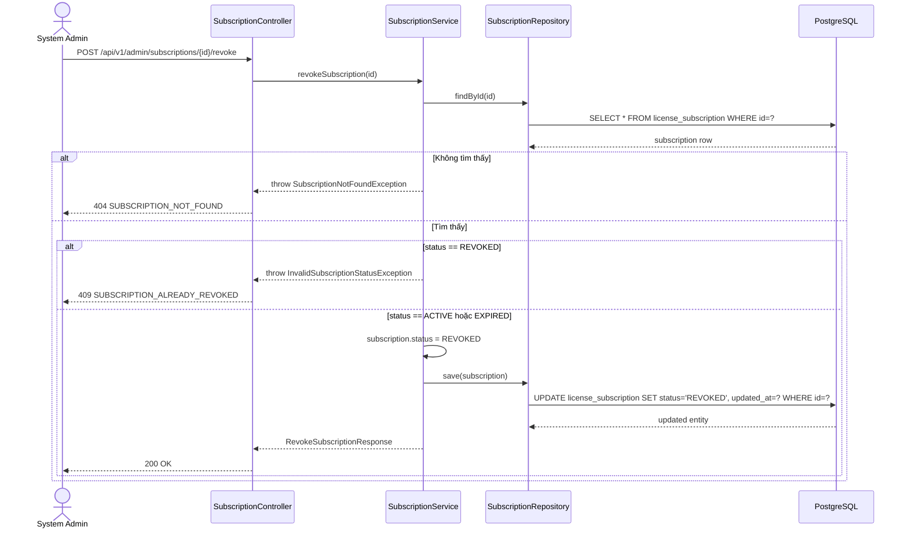
```mermaid
sequenceDiagram
   actor Admin as System Admin
   participant API as SubscriptionController
   participant SVC as SubscriptionService
   participant REPO as SubscriptionRepository
   participant DB as PostgreSQL

   Admin->>API: POST /api/v1/admin/subscriptions/{id}/revoke
   API->>SVC: revokeSubscription(id)
   SVC->>REPO: findById(id)
   REPO->>DB: SELECT * FROM license_subscription WHERE id=?
   DB-->>REPO: subscription row
   alt Không tìm thấy
      SVC-->>API: throw SubscriptionNotFoundException
      API-->>Admin: 404 SUBSCRIPTION_NOT_FOUND
   else Tìm thấy
      alt status == REVOKED
         SVC-->>API: throw InvalidSubscriptionStatusException
         API-->>Admin: 409 SUBSCRIPTION_ALREADY_REVOKED
      else status == ACTIVE hoặc EXPIRED
         SVC->>SVC: subscription.status = REVOKED
         SVC->>REPO: save(subscription)
         REPO->>DB: UPDATE license_subscription SET status='REVOKED', updated_at=? WHERE id=?
         DB-->>REPO: updated entity
         SVC-->>API: RevokeSubscriptionResponse
         API-->>Admin: 200 OK
      end
   end
```

### 13. Activity Diagram

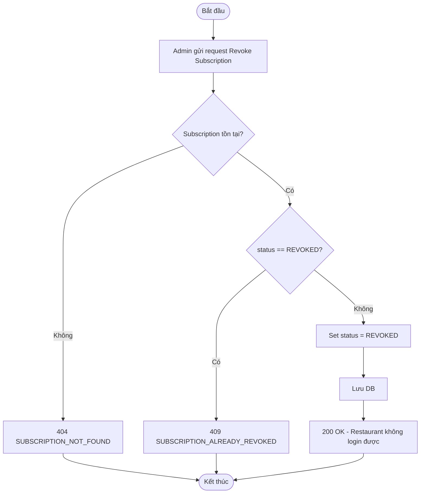
```mermaid
flowchart TD
   A([Bắt đầu]) --> B[Admin gửi request Revoke Subscription]
   B --> C{Subscription tồn tại?}
   C -- Không --> D[404 SUBSCRIPTION_NOT_FOUND]
   D --> Z([Kết thúc])
   C -- Có --> E{status == REVOKED?}
   E -- Có --> F[409 SUBSCRIPTION_ALREADY_REVOKED]
   F --> Z
   E -- Không --> G[Set status = REVOKED]
   G --> H[Lưu DB]
   H --> I[200 OK - Restaurant không login được]
   I --> Z
```

### 14. Business Logic (Pseudo Code)

```text
FUNCTION revokeSubscription(id: UUID) -> RevokeSubscriptionResponse:
    // TODO: PERMISSION CHECK - ADMIN_SUBSCRIPTION_REVOKE

    subscription = subscriptionRepository.findById(id)
    IF subscription == NULL:
        THROW SubscriptionNotFoundException("Subscription not found")

    IF subscription.status == SubscriptionStatus.REVOKED:
        THROW InvalidSubscriptionStatusException("Subscription is already revoked")

    subscription.status = SubscriptionStatus.REVOKED
    subscription.updatedAt = now()

    subscriptionRepository.save(subscription)

    // Business rule: Flow Login của Restaurant Management System phải kiểm tra
    // organization có Subscription ACTIVE hay không trước khi cho phép đăng nhập.
    // // TODO: PERMISSION CHECK / AUTH INTEGRATION - kiểm tra tại LoginService của
    // Restaurant Management System (ngoài phạm vi module License).

    RETURN new RevokeSubscriptionResponse(
        subscription.id, subscription.organizationId,
        subscription.status, subscription.updatedAt
    )
END FUNCTION
```

### 15. Edge Cases

| Edge Case | Xử lý |
|---|---|
| Revoke Subscription đã REVOKED | Trả `409 SUBSCRIPTION_ALREADY_REVOKED` |
| Revoke Subscription đang EXPIRED | Cho phép, chuyển thành `REVOKED` (đánh dấu rõ ràng lý do mất quyền là bị Admin chủ động thu hồi) |
| Revoke Subscription không tồn tại | Trả `404 SUBSCRIPTION_NOT_FOUND` |
| Revoke Subscription rồi Renew lại | Bị từ chối ở bước Renew (`409 SUBSCRIPTION_ALREADY_REVOKED` — xem UC-SUB-01 BR-09) |
| Organization có nhân viên đang trong phiên đăng nhập (session) tại thời điểm bị Revoke | Ngoài phạm vi tài liệu này — thuộc về cơ chế session invalidation của Restaurant Management System |

### 16. Acceptance Criteria

- [ ] Revoke Subscription ACTIVE thành công → `status = REVOKED`.
- [ ] Revoke Subscription đã REVOKED → `409 SUBSCRIPTION_ALREADY_REVOKED`.
- [ ] Revoke Subscription không tồn tại → `404`.
- [ ] Sau khi Revoke, Organization không còn Subscription ACTIVE nào.
- [ ] Sau khi Revoke, Restaurant thuộc Organization đó không thể Login (kiểm tra tích hợp, ngoài phạm vi trực tiếp của module License nhưng phải đảm bảo dữ liệu `status=REVOKED` được lưu đúng để flow Login đọc được).

### 17. Test Scenarios

**Happy Path**
- TC-01: Revoke Subscription đang ACTIVE → 200, status=REVOKED.

**Validation**
- TC-02: `id` không đúng UUID format → 400.

**Boundary**
- (Không áp dụng)

**Exception**
- TC-03: Revoke Subscription không tồn tại → 404.
- TC-04: Revoke Subscription đã REVOKED (gọi 2 lần liên tiếp) → lần 2 trả 409.

**Business Rule**
- TC-05: Revoke Subscription EXPIRED vẫn thành công, chuyển sang REVOKED.
- TC-06: Sau khi Revoke, thử Renew lại Subscription đó → bị từ chối 409 `SUBSCRIPTION_ALREADY_REVOKED`.
- TC-07: Sau khi Revoke, kiểm tra Organization không còn bản ghi Subscription nào có `status=ACTIVE`.

---

## UC-SUB-03: View License Detail

### 1. Overview

| | |
|---|---|
| **Use Case ID** | UC-SUB-03 |
| **Use Case Name** | View License Detail |
| **Description** | System Admin xem chi tiết một License, kèm theo thông tin Organization và Subscription liên quan (theo cấu trúc phân cấp License → Organization → Subscription như mô tả trong yêu cầu gốc). |
| **Actor** | System Admin |
| **Priority** | Medium |

### 2. Business Rules

- BR-01: Hiển thị đầy đủ 3 tầng thông tin: **License** + **Organization** + **Subscription**, theo cấu trúc phân cấp:
  ```
  License (Professional)
    └── Organization (ABC Restaurant)
          └── Subscription (Start Date, End Date, Status, Price, Billing Cycle, Max Branch, Max Employee)
  ```
- BR-02: Một License có thể được cấp cho **nhiều Organization** (thông qua nhiều Subscription khác nhau qua thời gian, hoặc nhiều Organization khác nhau tại cùng thời điểm) → API phải trả về **danh sách** Organization + Subscription tương ứng, không chỉ 1 cặp.
- BR-03: Vì Subscription lưu snapshot, các field `price, billing_cycle, max_branch, max_employee` hiển thị trong danh sách Subscription phải lấy từ **chính Subscription** đó (snapshot), KHÔNG lấy lại từ License hiện hành — để phản ánh đúng giá trị tại thời điểm Subscription được cấp.
- BR-04: License đã bị soft-delete (`deleted_at != NULL`) **vẫn xem được chi tiết** qua UC này (khác với các danh sách nghiệp vụ khác mặc định loại trừ deleted) — vì mục đích của View Detail bao gồm cả tra cứu lịch sử/audit.

### 3. Preconditions

- Actor đã đăng nhập với vai trò System Admin.
- `// TODO: PERMISSION CHECK` — Actor có quyền `ADMIN_LICENSE_VIEW`.
- License với `id` tương ứng tồn tại (kể cả đã soft-delete).

### 4. Postconditions

- Không có thay đổi dữ liệu (đây là Use Case chỉ đọc — read-only).

### 5. Main Flow

1. System Admin gửi request `GET /api/v1/admin/licenses/{id}/detail`.
2. Hệ thống tìm License theo `id` (bao gồm cả đã soft-delete, dùng `findByIdIncludeDeleted`).
3. Hệ thống tìm toàn bộ `License_Subscription` có `license_id = id`, kèm theo thông tin `Organization` tương ứng của từng Subscription (JOIN).
4. Hệ thống nhóm dữ liệu theo cấu trúc `License → [ { Organization, Subscription } ]`.
5. Hệ thống trả về `200 OK` cùng dữ liệu chi tiết.

### 6. Alternative Flow

- **AF-01**: Nếu License chưa từng được cấp cho Organization nào (chưa có Subscription nào), hệ thống vẫn trả về `200 OK` với danh sách `organizations` rỗng (`[]`), không coi là lỗi.

### 7. Exception Flow

- **EF-01**: License không tồn tại (kể cả kiểm tra bao gồm đã soft-delete) → `404 Not Found`, error code `LICENSE_NOT_FOUND`.
- **EF-02**: Lỗi hệ thống → `500`, `INTERNAL_SERVER_ERROR`.

### 8. Validation Rules

| Field | Rule |
|---|---|
| `id` (path variable) | required, UUID hợp lệ, License phải tồn tại (kể cả đã soft-delete) |
| `page`, `size` (query, optional) | nếu số lượng Subscription lớn, đề xuất phân trang: `page >= 0`, `size` trong khoảng `[1, 100]`, mặc định `size=20` |

### 9. Database Changes

Không có (Use Case chỉ đọc, không có DB change).

### 10. API Design

**Method**: `GET`
**URL**: `/api/v1/admin/licenses/{id}/detail`

**Headers**
```
Authorization: Bearer {jwt_token}
```

**Query Params (optional)**
```
?page=0&size=20
```

**Request**: Không có body.

**Response (200 OK)**
```json
{
   "success": true,
   "data": {
      "license": {
         "id": "b1e2c3d4-0000-0000-0000-000000000001",
         "code": "PRO_PLAN",
         "name": "Professional",
         "description": "Dành cho nhà hàng vừa và nhỏ",
         "price": 990000,
         "billingCycle": "MONTHLY",
         "maxBranch": 5,
         "maxEmployee": 50,
         "status": "ACTIVE",
         "deletedAt": null
      },
      "organizations": [
         {
            "organization": {
               "id": "a9b8c7d6-0000-0000-0000-000000000099",
               "name": "ABC Restaurant"
            },
            "subscription": {
               "id": "c2d3e4f5-0000-0000-0000-000000000010",
               "startDate": "2026-01-01",
               "endDate": "2026-08-22",
               "status": "ACTIVE",
               "price": 990000,
               "billingCycle": "MONTHLY",
               "maxBranch": 5,
               "maxEmployee": 50
            }
         }
      ],
      "pagination": {
         "page": 0,
         "size": 20,
         "totalElements": 1,
         "totalPages": 1
      }
   },
   "error": null
}
```

**HTTP Status**: `200`, `404`, `401/403`, `500`
**Error Codes**: `LICENSE_NOT_FOUND`, `UNAUTHORIZED`, `FORBIDDEN`, `INTERNAL_SERVER_ERROR`

### 11. DTO Design

**Request DTO**: Không cần body; query param map vào `Pageable` (Spring Data).

**Response DTO — `LicenseDetailResponse`**
```java
public class LicenseDetailResponse {
   private LicenseResponse license;
   private List<OrganizationSubscriptionResponse> organizations;
   private PaginationResponse pagination;
}

public class OrganizationSubscriptionResponse {
   private OrganizationSummary organization;
   private SubscriptionResponse subscription;
}

public class OrganizationSummary {
   private UUID id;
   private String name;
}

public class PaginationResponse {
   private int page;
   private int size;
   private long totalElements;
   private int totalPages;
}
```

> Ghi chú: `LicenseResponse` bổ sung thêm field `deletedAt` so với mục 11 của UC-LIC-01 để phục vụ hiển thị đúng trạng thái đã xoá hay chưa trong màn hình chi tiết.

### 12. Sequence Diagram

```mermaid
sequenceDiagram
   actor Admin as System Admin
   participant API as LicenseController
   participant SVC as LicenseService
   participant LREPO as LicenseRepository
   participant SREPO as LicenseSubscriptionRepository
   participant DB as PostgreSQL

   Admin->>API: GET /api/v1/admin/licenses/{id}/detail?page=0&size=20
   API->>SVC: getLicenseDetail(id, pageable)
   SVC->>LREPO: findByIdIncludeDeleted(id)
   LREPO->>DB: SELECT * FROM license WHERE id=?
   DB-->>LREPO: license row (hoặc rỗng)
   alt Không tìm thấy
      SVC-->>API: throw LicenseNotFoundException
      API-->>Admin: 404 LICENSE_NOT_FOUND
   else Tìm thấy
      SVC->>SREPO: findByLicenseIdWithOrganization(id, pageable)
      SREPO->>DB: SELECT s.*, o.* FROM license_subscription s JOIN organization o ON s.organization_id=o.id WHERE s.license_id=?
      DB-->>SREPO: list of (subscription, organization)
      SREPO-->>SVC: Page<OrganizationSubscriptionProjection>
      SVC->>SVC: build LicenseDetailResponse
      SVC-->>API: LicenseDetailResponse
      API-->>Admin: 200 OK + LicenseDetailResponse
   end
```

### 13. Activity Diagram

```mermaid
flowchart TD
   A([Bắt đầu]) --> B[Admin gửi request xem chi tiết License]
   B --> C{License tồn tại kể cả đã xoá?}
   C -- Không --> D[404 LICENSE_NOT_FOUND]
   D --> Z([Kết thúc])
   C -- Có --> E[Truy vấn danh sách Subscription + Organization theo license_id]
   E --> F{Có Subscription nào không?}
   F -- Không --> G["Trả về organizations = rỗng"]
   F -- Có --> H["Trả về danh sách Organization + Subscription (đã phân trang)"]
   G --> I[200 OK]
   H --> I
   I --> Z
```

### 14. Business Logic (Pseudo Code)

```text
FUNCTION getLicenseDetail(id: UUID, pageable: Pageable) -> LicenseDetailResponse:
    // TODO: PERMISSION CHECK - ADMIN_LICENSE_VIEW

    license = licenseRepository.findByIdIncludeDeleted(id)
    IF license == NULL:
        THROW LicenseNotFoundException("License not found")

    page = subscriptionRepository.findByLicenseIdWithOrganization(id, pageable)

    organizationList = []
    FOR EACH row IN page.content:
        organizationList.ADD(
            OrganizationSubscriptionResponse(
                organization = OrganizationSummary(row.organizationId, row.organizationName),
                subscription = SubscriptionResponse(
                    id = row.subscriptionId,
                    startDate = row.startDate,
                    endDate = row.endDate,
                    status = row.status,
                    price = row.price,               // snapshot, KHÔNG lấy từ license hiện hành
                    billingCycle = row.billingCycle,  // snapshot
                    maxBranch = row.maxBranch,        // snapshot
                    maxEmployee = row.maxEmployee     // snapshot
                )
            )
        )

    RETURN LicenseDetailResponse(
        license = licenseMapper.toResponse(license),
        organizations = organizationList,
        pagination = PaginationResponse(page.number, page.size, page.totalElements, page.totalPages)
    )
END FUNCTION
```

### 15. Edge Cases

| Edge Case | Xử lý |
|---|---|
| License chưa có Subscription nào | Trả `organizations = []`, không phải lỗi |
| License đã bị soft-delete | Vẫn xem được chi tiết bình thường (khác với danh sách License thường) |
| License được cấp cho nhiều Organization (nhiều Subscription khác nhau) | Trả về đầy đủ danh sách, có phân trang |
| Organization có nhiều Subscription lịch sử (ACTIVE hiện tại + EXPIRED/REVOKED trước đó) | Hiển thị tất cả các Subscription từng cấp từ License này cho Organization đó (không chỉ Subscription ACTIVE), mỗi Subscription là 1 dòng riêng trong danh sách |
| License đã bị sửa đổi giá/billing_cycle nhiều lần (UC-LIC-02) sau khi các Subscription đã được cấp | Danh sách Subscription vẫn hiển thị đúng snapshot tại thời điểm cấp — KHÔNG bị ghi đè theo giá trị License hiện tại |
| `id` không tồn tại | 404 |

### 16. Acceptance Criteria

- [ ] Xem chi tiết License trả về đầy đủ thông tin License + danh sách Organization + Subscription tương ứng.
- [ ] Field snapshot (`price, billingCycle, maxBranch, maxEmployee`) trong từng Subscription hiển thị đúng giá trị tại thời điểm cấp, không lấy từ License hiện hành.
- [ ] License chưa có Subscription nào vẫn trả về `200` với danh sách rỗng.
- [ ] License đã bị soft-delete vẫn xem được chi tiết.
- [ ] License không tồn tại → `404`.
- [ ] Danh sách Organization/Subscription hỗ trợ phân trang khi số lượng lớn.

### 17. Test Scenarios

**Happy Path**
- TC-01: Xem chi tiết License có 1 Organization + 1 Subscription ACTIVE → 200, dữ liệu đầy đủ đúng cấu trúc phân cấp.
- TC-02: Xem chi tiết License được cấp cho nhiều Organization → 200, danh sách đầy đủ tất cả Organization liên quan.

**Validation**
- TC-03: `id` không đúng UUID format → 400.
- TC-04: `page` âm → 400 (nếu áp dụng validate query param).

**Boundary**
- TC-05: License chưa có Subscription nào → 200, `organizations = []`.
- TC-06: Danh sách Subscription vượt quá `size` mặc định (ví dụ 50 Subscription, `size=20`) → phân trang đúng, `totalPages` tính đúng.

**Exception**
- TC-07: Xem chi tiết License không tồn tại → 404.

**Business Rule**
- TC-08: License đã sửa `price` sau khi đã cấp Subscription — xem chi tiết vẫn hiển thị `price` snapshot cũ trong Subscription, không phải `price` mới của License.
- TC-09: Xem chi tiết License đã bị soft-delete — vẫn trả về đầy đủ dữ liệu (200), không trả 404.
- TC-10: Organization có nhiều Subscription theo thời gian (1 ACTIVE hiện tại, 2 EXPIRED/REVOKED trước đó từ cùng License) — tất cả đều xuất hiện trong danh sách, không chỉ Subscription ACTIVE.

---

## 13. Phụ lục: Định hướng mở rộng cho Payment (Future Design)

Theo yêu cầu gốc, hệ thống hiện tại **chưa tích hợp Payment**, nhưng đặc tả phải đảm bảo dễ mở rộng theo hướng **Domain Driven Design (DDD)**, không hard-code logic gắn chặt với việc "Admin cấp License thủ công". Các điểm thiết kế sau đây được đưa vào Specification hiện tại nhằm chuẩn bị cho việc mở rộng:

### 13.1. Tách bạch rõ ràng giữa "License Plan" và "License Subscription"

- `License` đóng vai trò **Catalog/Plan** — tương tự khái niệm "Product" trong domain thanh toán. Việc này cho phép sau này gắn thêm bảng `payment_plan_mapping` hoặc tích hợp trực tiếp với cổng thanh toán (Stripe/VNPay/Momo...) mà không cần đổi cấu trúc `License`.
- `License_Subscription` đóng vai trò **Order/Grant Record** — tương tự khái niệm "Subscription" trong các nền tảng SaaS billing (Stripe Billing, Chargebee...). Việc snapshot dữ liệu tại `License_Subscription` giúp tách rời vòng đời của "hợp đồng đã ký" khỏi "bảng giá hiện tại", đúng theo nguyên tắc Bounded Context trong DDD.

### 13.2. Vị trí sẽ chèn Payment Domain trong tương lai

```mermaid
flowchart LR
   subgraph Hiện tại - Phase này
      A[System Admin] -->|Cấp thủ công| B[License_Subscription]
   end
   subgraph Tương lai - Payment Phase
      C[Restaurant Owner] --> D[Payment Gateway]
      D --> E[Payment Service - Bounded Context mới]
      E -->|Sau khi thanh toán thành công| B
   end
   F[License Catalog] --> B
```

- Khi tích hợp Payment, chỉ cần bổ sung một **Application Service mới** (ví dụ `PaymentGrantSubscriptionService`) đóng vai trò gọi lại đúng logic tạo `License_Subscription` snapshot (tái sử dụng lại toàn bộ logic snapshot đã thiết kế ở UC-LIC hiện tại), thay vì phải sửa cấu trúc dữ liệu hiện có.
- Trường `License_Subscription` không cần thêm cột `payment_id` ngay bây giờ; khi cần, chỉ cần bổ sung cột nullable `payment_reference_id` (migration mới, không phá vỡ dữ liệu cũ).

### 13.3. Nguyên tắc Domain Driven Design áp dụng

- **Aggregate Root**: `License_Subscription` là Aggregate Root của Bounded Context "Subscription Management", đảm bảo tính nhất quán của invariant "1 Organization chỉ có 1 Subscription ACTIVE" thông qua Repository + Unique Index (mục 3.2).
- **Value Object**: Các field snapshot (`price, billingCycle, maxBranch, maxEmployee`) trên `License_Subscription` có thể được nhóm thành 1 Value Object `LicenseSnapshot` ở tầng Domain Model (dù ở tầng DB vẫn là các cột phẳng để đơn giản hoá truy vấn).
- **Domain Event (đề xuất cho tương lai)**: Khi Renew/Revoke Subscription thành công, có thể publish domain event (`SubscriptionRenewedEvent`, `SubscriptionRevokedEvent`) để các Bounded Context khác (Notification, Audit Log, Billing) lắng nghe mà không cần coupling trực tiếp vào `LicenseSubscriptionService`.

---

## Kết luận

Tài liệu trên đặc tả đầy đủ 8 Use Case thuộc module **License & Subscription Management** của **Admin System** trong **Restaurant CRM Platform**, bao gồm toàn bộ Business Rule bắt buộc đã nêu trong yêu cầu gốc:

- Snapshot bất biến của Subscription so với License.
- Ràng buộc 1 Organization chỉ có 1 Subscription ACTIVE.
- Soft Delete cho License.
- State Machine đầy đủ cho License (`ACTIVE ⇄ LOCKED`) và Subscription (`ACTIVE → EXPIRED/REVOKED`, `EXPIRED → ACTIVE` qua Renew).
- Công thức tính `end_date` khi Renew theo 2 trường hợp còn hạn / hết hạn.
- Quy tắc Revoke chặn Login.

Backend Team có thể triển khai trực tiếp dựa trên: Database Schema (mục 3), API Design, DTO Design, Business Logic pseudo code, và Test Scenarios của từng Use Case mà không cần hỏi lại Business Analyst cho các nghiệp vụ đã nêu trong tài liệu này.